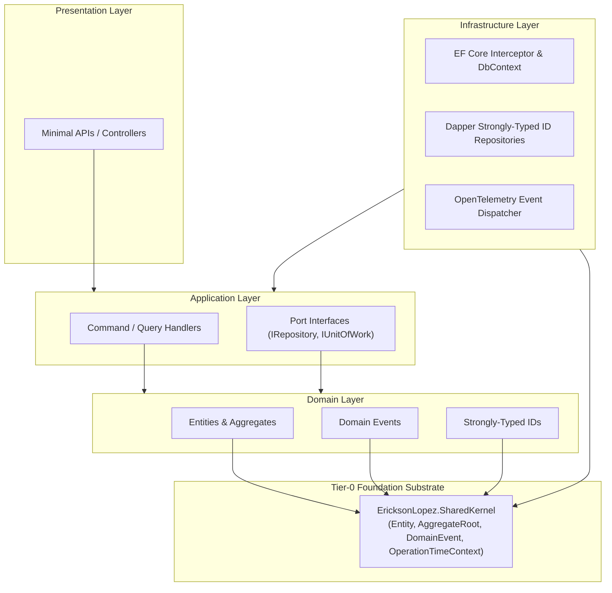

# EricksonLopez.SharedKernel

High-performance, zero-allocation, enterprise-grade Domain-Driven Design (DDD) and Clean Architecture foundational substrate for modern .NET.

[](https://github.com/ericksonlopezf/dotnet-shared-kernel/actions)
[](https://codecov.io/gh/ericksonlopezf/dotnet-shared-kernel)
[](https://sonarcloud.io/summary/new_code?id=ericksonlopezf_dotnet-shared-kernel)
[](https://github.com/ericksonlopezf/dotnet-shared-kernel/blob/main/docs/mutation-score.md)
[](https://www.nuget.org/packages/EricksonLopez.SharedKernel)
[](https://www.nuget.org/packages/EricksonLopez.SharedKernel)
[](https://github.com/ericksonlopezf/dotnet-shared-kernel/blob/main/LICENSE)
[](https://dotnet.microsoft.com)
[](https://learn.microsoft.com/en-us/dotnet/core/deploying/native-aot)

---

**EricksonLopez.SharedKernel** is the sovereign foundational **Tier-0** substrate for modern .NET (`.NET 8`, `.NET 9`, `.NET 10`) enterprise applications. It provides high-performance, struct-based Domain-Driven Design (DDD) building blocks, aggregate root domain event collection, Clean Architecture port contracts, zero-allocation Dapper TypeHandler adapters, Entity Framework Core interceptors, and compile-time Roslyn source generators with zero runtime reflection.

---

## Table of Contents

- [What Problem It Solves](#-what-problem-it-solves)
- [Key Features](#-key-features)
- [Ecosystem](#-ecosystem)
- [Documentation](#-documentation)
  - [Interactive Showcase (Levels 00 to 08)](#-step-by-step-interactive-showcase-levels-00-to-08)
  - [Technical Reference & Architecture Guides](#-technical-reference--architecture-guides)
- [Installation](#-installation)
- [Quick Start](#-quick-start)
  - [1. Defining Strongly-Typed IDs](#1-defining-strongly-typed-ids)
  - [2. Modeling Entities and Aggregate Roots](#2-modeling-entities-and-aggregate-roots)
  - [3. Raising and Draining Domain Events](#3-raising-and-draining-domain-events)
  - [4. Entity Framework Core Integration](#4-entity-framework-core-integration)
  - [5. Dapper Native AOT Type Registration](#5-dapper-native-aot-type-registration)
- [Core Use Cases](#-core-use-cases)
  - [Use Case 1: Pure Domain Model with Invariant Protection & Factory Methods](#use-case-1-pure-domain-model-with-invariant-protection--factory-methods)
  - [Use Case 2: Multi-Step Aggregate Workflow with Domain Event Inception](#use-case-2-multi-step-aggregate-workflow-with-domain-event-inception)
  - [Use Case 3: Clean Architecture CQRS Handler with Polymorphic Event Draining](#use-case-3-clean-architecture-cqrs-handler-with-polymorphic-event-draining)
  - [Use Case 4: Zero-Allocation Dapper Strongly-Typed ID Persistence](#use-case-4-zero-allocation-dapper-strongly-typed-id-persistence)
  - [Use Case 5: Compile-Time Persistence Metadata for Zero-Reflection Mapping](#use-case-5-compile-time-persistence-metadata-for-zero-reflection-mapping)
  - [Use Case 6: Distributed OpenTelemetry Activity Tracing & Metrics](#use-case-6-distributed-opentelemetry-activity-tracing--metrics)
- [Configuration & Integrations](#-configuration--integrations)
  - [Entity Framework Core Configuration](#entity-framework-core-configuration)
  - [Dapper Type Handlers & Source Generation](#dapper-type-handlers--source-generation)
  - [Compile-Time Persistence Metadata & Source Generation](#compile-time-persistence-metadata--source-generation)
  - [System.Text.Json Serialization](#systemtextjson-serialization)
  - [OpenTelemetry Tracing & Metrics](#opentelemetry-tracing--metrics)
  - [Roslyn Incremental Source Generators](#roslyn-incremental-source-generators)
- [Testing & Quality](#-testing--quality)
  - [Domain Event Assertions & Collector](#domain-event-assertions--collector)
  - [Asynchronous Testing Safety](#asynchronous-testing-safety)
  - [Mutation Testing & Quality Gates](#mutation-testing--quality-gates)
- [Performance Benchmarks](#-performance-benchmarks)
  - [Primary Operations Benchmark](#primary-operations-benchmark)
  - [Competitive Parity Benchmark (vs Ardalis.SharedKernel)](#competitive-parity-benchmark-vs-ardalissharedkernel)
- [Compatibility & Technical Matrix](#-compatibility--technical-matrix)
  - [Target Frameworks & Native AOT Support](#target-frameworks--native-aot-support)
  - [Reflection-Free AOT API Alternatives](#reflection-free-aot-api-alternatives)
- [Architecture & Design Principles](#-architecture--design-principles)
  - [Clean Architecture Boundary Flow](#clean-architecture-boundary-flow)
  - [Aggregate Lifecycle & Lazy Domain Event Buffer](#aggregate-lifecycle--lazy-domain-event-buffer)
  - [Core Invariants & Sovereign Boundaries](#core-invariants--sovereign-boundaries)
- [Best Practices & Anti-Patterns](#-best-practices--anti-patterns)
- [Troubleshooting & Common Pitfalls](#-troubleshooting--common-pitfalls)
- [Part of the EricksonLopez Ecosystem](#-part-of-the-ericksonlopez-ecosystem)
- [Contributing](#-contributing)
- [License](#-license)

---

## 🎯 What Problem It Solves

Enterprise Domain-Driven Design (DDD) implementations frequently suffer from architectural friction, excessive GC allocations, and framework tight coupling:

1. **Primitive Obsession & Parameter Transposition Bugs:**
   Passing raw `Guid` or `int` identifiers across service boundaries allows accidentally supplying a `customerId` where an `orderId` was expected without triggering compile-time errors.
2. **Eager Memory Allocation on Read Paths:**
   Traditional DDD frameworks eagerly instantiate event collections (`new List<IDomainEvent>()`) inside the entity constructor. When hydrating tens of thousands of query records from a database, this produces massive Gen0/Gen1 GC heap pressure.
3. **ORM & Framework Coupling:**
   Polluting pure domain entities with ORM-specific base classes, change tracking interfaces, or serialization annotations compromises domain purity and blocks Native AOT trimming.
4. **Data Access Boilerplate:**
   Mapping strongly-typed identifiers and BCL date/time types in Dapper traditionally requires reflection or custom boilerplate, which breaks Native AOT compilation.
5. **Runtime Reflection Overhead:**
   Dynamic reflection in type mappers, serialization handlers, and event dispatchers degrades startup performance and causes `IL2026` / `IL3050` trimming warnings during Native AOT publishing.

### How `EricksonLopez.SharedKernel` Solves This

- **Zero-Allocation Struct Identifiers:** Strongly-typed IDs implement `IStrongId<TSelf, TValue>` as `readonly record struct` instances, generating **0 B heap allocation**.
- **Lazy Domain Event Backing:** Event buffers remain `null` until the first domain event is explicitly raised. Read-only entity hydration produces **0 B event overhead**.
- **Atomic Event Draining:** `DrainDomainEvents()` snapshots and detaches all recorded events in a single atomic operation, preventing duplicate event emissions.
- **Sovereign Port Contracts:** Pure domain port contracts (`IEntity<TId>`, `IAggregateRoot`, `IHasDomainEvents`, `IDomainEventDispatcher`) with zero third-party dependencies (strictly BCL and Tier-0 `EricksonLopez.Events.Contracts`), completely decoupled from persistence engines.
- **Native AOT Dapper Type Handlers:** Zero-allocation parameter mapping and reading for strongly-typed identifiers and BCL date/time types via `EricksonLopez.SharedKernel.Dapper`.
- **Compile-Time Persistence Metadata:** `EricksonLopez.SharedKernel.Persistence` and Roslyn incremental generators provide static table, column, audit, and tenant metadata without runtime reflection (ADR-037).
- **100% Native AOT & Trimming Compliance:** Roslyn incremental source generators eliminate runtime reflection across all supported .NET runtimes.

---

## ⚡ Key Features

- 🚀 **Zero-Allocation Identity Envelope**: Strongly-typed entity identifiers modeled as `readonly record struct` with compile-time type safety.
- 📦 **Lazy Domain Event Storage**: Zero GC heap allocations on read-only entity queries and hydration paths.
- ⚡ **Zero-Allocation Dapper Type Handlers**: Ultra-fast Native AOT parameter mapping and reading via `EricksonLopez.SharedKernel.Dapper`.
- 🧩 **EF Core Domain Event Interceptors**: Transparent domain event extraction and dispatching on `SaveChangesAsync`.
- 🛡️ **Roslyn Incremental Source Generators**: Compile-time code generation for zero-reflection Dapper registrations and domain metadata.
- 🏛️ **Compile-Time Persistence Metadata**: Explicit `[Table]`, `[Column]`, `[TenantScoped]`, and `[Audit]` schema descriptors for AOT persistence (ADR-037).
- 📊 **First-Class OpenTelemetry**: Distributed Activity tracing and BCL `System.Diagnostics.Metrics` instrumentation.
- 🧪 **Declarative Test Doubles & Assertions**: Fluent domain event assertion helpers (`DomainEventCollector`) for xUnit, NUnit, and MSTest.
- 🌐 **100% Native AOT & Trimmable**: Full compliance with `<IsAotCompatible>true</IsAotCompatible>` and `<IsTrimmable>true</IsTrimmable>` across .NET 8, 9, and 10.

---

## 📦 Ecosystem

| Package | Version | Description |
|---|---|---|
| [`EricksonLopez.SharedKernel`](https://www.nuget.org/packages/EricksonLopez.SharedKernel) | [](https://www.nuget.org/packages/EricksonLopez.SharedKernel) | Core Tier-0 DDD primitives (`Entity<TId>`, `AggregateRoot<TId>`, `DomainEvent`, `OperationTimeContext`) |
| [`EricksonLopez.SharedKernel.EntityFrameworkCore`](https://www.nuget.org/packages/EricksonLopez.SharedKernel.EntityFrameworkCore) | [](https://www.nuget.org/packages/EricksonLopez.SharedKernel.EntityFrameworkCore) | EF Core `DomainEventsInterceptor` and Native AOT `StrongIdValueConverter` model extensions |
| [`EricksonLopez.SharedKernel.Dapper`](https://www.nuget.org/packages/EricksonLopez.SharedKernel.Dapper) | [](https://www.nuget.org/packages/EricksonLopez.SharedKernel.Dapper) | Native AOT Dapper TypeHandler adapters and BCL date/time handlers |
| [`EricksonLopez.SharedKernel.Json`](https://www.nuget.org/packages/EricksonLopez.SharedKernel.Json) | [](https://www.nuget.org/packages/EricksonLopez.SharedKernel.Json) | System.Text.Json converters for strongly-typed identifiers |
| [`EricksonLopez.SharedKernel.Persistence`](https://www.nuget.org/packages/EricksonLopez.SharedKernel.Persistence) | [](https://www.nuget.org/packages/EricksonLopez.SharedKernel.Persistence) | Compile-time persistence metadata descriptors (`[Table]`, `[Column]`, `[TenantScoped]`, `[Audit]`, `EntityMetadata`) for zero-reflection Native AOT data access |
| [`EricksonLopez.SharedKernel.SourceGenerators`](https://www.nuget.org/packages/EricksonLopez.SharedKernel.SourceGenerators) | [](https://www.nuget.org/packages/EricksonLopez.SharedKernel.SourceGenerators) | Roslyn incremental source generators for compile-time Native AOT Dapper registrations and domain entity persistence metadata |
| [`EricksonLopez.SharedKernel.OpenTelemetry`](https://www.nuget.org/packages/EricksonLopez.SharedKernel.OpenTelemetry) | [](https://www.nuget.org/packages/EricksonLopez.SharedKernel.OpenTelemetry) | W3C distributed Activity context tracing and metrics for domain event dispatching |
| [`EricksonLopez.SharedKernel.Testing`](https://www.nuget.org/packages/EricksonLopez.SharedKernel.Testing) | [](https://www.nuget.org/packages/EricksonLopez.SharedKernel.Testing) | Fluent assertions, event collectors, and test doubles for domain aggregate validation |

---

## 📚 Documentation

> 🌐 **Official Documentation Hub:** [https://github.com/ericksonlopezf/dotnet-shared-kernel/tree/main/docs](https://github.com/ericksonlopezf/dotnet-shared-kernel/tree/main/docs)

### 🎓 Step-by-Step Interactive Showcase (Levels 00 to 08)

| Level | Topic | Description |
|---|---|---|
| [**Level 00**](https://github.com/ericksonlopezf/dotnet-shared-kernel/blob/main/docs/showcase/level-00-introduction.md) | **Architecture & Philosophy** | Foundational Tier-0 DDD substrate and Clean Architecture boundaries |
| [**Level 01**](https://github.com/ericksonlopezf/dotnet-shared-kernel/blob/main/docs/showcase/level-01-entities-and-ids.md) | **Entities & Strongly-Typed IDs** | Eliminating Primitive Obsession with zero-allocation record struct IDs |
| [**Level 02**](https://github.com/ericksonlopezf/dotnet-shared-kernel/blob/main/docs/showcase/level-02-aggregates-and-events.md) | **Aggregates & Domain Events** | Encapsulating invariants and lazy event collection in `AggregateRoot<TId>` |
| [**Level 03**](https://github.com/ericksonlopezf/dotnet-shared-kernel/blob/main/docs/showcase/level-03-value-objects.md) | **Value Objects & Structural Equality** | Modeling immutable domain concepts with struct-based value types |
| [**Level 04**](https://github.com/ericksonlopezf/dotnet-shared-kernel/blob/main/docs/showcase/level-04-repositories-and-uow.md) | **Repository & Unit of Work Ports** | Declaring pure persistence contracts decoupled from ORM frameworks |
| [**Level 05**](https://github.com/ericksonlopezf/dotnet-shared-kernel/blob/main/docs/showcase/level-05-efcore-integration.md) | **EF Core Persistence** | Intercepting `SaveChangesAsync` for atomic domain event dispatching |
| [**Level 06**](https://github.com/ericksonlopezf/dotnet-shared-kernel/blob/main/docs/showcase/level-06-dapper-persistence.md) | **Dapper Strongly-Typed ID Persistence** | Zero-allocation strongly-typed ID mapping and Dapper type handlers |
| [**Level 07**](https://github.com/ericksonlopezf/dotnet-shared-kernel/blob/main/docs/showcase/level-07-sourcegen-and-aot.md) | **Source Generation & NativeAOT** | Compile-time code generation for strongly typed IDs without reflection |
| [**Level 08**](https://github.com/ericksonlopezf/dotnet-shared-kernel/blob/main/docs/showcase/level-08-telemetry-and-testing.md) | **Telemetry & Fluent Testing** | OpenTelemetry activity tracing and declarative unit testing assertions |

### 📖 Technical Reference & Architecture Guides

- [**Architecture & Invariants**](https://github.com/ericksonlopezf/dotnet-shared-kernel/blob/main/docs/architecture.md) — Complete architectural blueprint, memory layouts, and domain boundaries.
- [**Architectural Decision Records (ADRs)**](https://github.com/ericksonlopezf/dotnet-shared-kernel/blob/main/docs/adr/readme.md) — 37 formal ADRs documenting design rationale and rejected proposals.
- [**Technical Audit**](https://github.com/ericksonlopezf/dotnet-shared-kernel/blob/main/docs/audit.md) — Comprehensive technical audit, system invariants, and verification.
- [**Competitive Audit**](https://github.com/ericksonlopezf/dotnet-shared-kernel/blob/main/docs/competitive-audit.md) — In-depth market comparison vs Ardalis.SharedKernel and CSharpFunctionalExtensions.
- [**Feature Catalog & Specs**](https://github.com/ericksonlopezf/dotnet-shared-kernel/blob/main/docs/features.md) — Exhaustive specification of all core types, aggregates, and extensions.
- [**Features & Compatibility Matrix**](https://github.com/ericksonlopezf/dotnet-shared-kernel/blob/main/docs/features-matrix.md) — Target framework matrix, Native AOT status, and trimming diagnostics.
- [**Testing & Quality Audit**](https://github.com/ericksonlopezf/dotnet-shared-kernel/blob/main/docs/quality-audit.md) — Verification topology, fast-path testing, and mutation metrics.
- [**Best Practices Guide**](https://github.com/ericksonlopezf/dotnet-shared-kernel/blob/main/docs/best-practices.md) — Recommended production patterns for microservices and domain logic.
- [**Anti-Patterns Guide**](https://github.com/ericksonlopezf/dotnet-shared-kernel/blob/main/docs/anti-patterns.md) — Unsafe patterns, state bugs, and architectural anti-patterns to avoid.
- [**Cookbook & Recipes**](https://github.com/ericksonlopezf/dotnet-shared-kernel/blob/main/docs/cookbook.md) — Ready-to-use recipes for EF Core, Dapper Type Handlers, OpenTelemetry, and testing.
- [**Internationalization (i18n)**](https://github.com/ericksonlopezf/dotnet-shared-kernel/blob/main/docs/internationalization.md) — Culture-invariant numeric and string parsing specifications.
- [**Migration Guide**](https://github.com/ericksonlopezf/dotnet-shared-kernel/blob/main/docs/migration-guide.md) — Step-by-step guide for migrating from legacy shared kernel libraries.
- [**Allocation Analysis**](https://github.com/ericksonlopezf/dotnet-shared-kernel/blob/main/docs/analysis/allocations.md) — Memory benchmarks, struct layout, and zero-allocation mechanics.
- [**Mutation Score Report**](https://github.com/ericksonlopezf/dotnet-shared-kernel/blob/main/docs/mutation-score.md) — Stryker.NET 100% mutation score verification across all packages.
- [**Package Reference**](https://github.com/ericksonlopezf/dotnet-shared-kernel/blob/main/docs/package-reference.md) — Full dependency graph and per-package metadata.
- [**Public API Specification**](https://github.com/ericksonlopezf/dotnet-shared-kernel/blob/main/docs/public-api.md) — Exhaustive inventory of all public types, methods, and contract signatures.
- [**Performance Tuning Guide**](https://github.com/ericksonlopezf/dotnet-shared-kernel/blob/main/docs/performance-guide.md) — Optimization strategies for high-throughput enterprise systems.
- [**Frequently Asked Questions (FAQ)**](https://github.com/ericksonlopezf/dotnet-shared-kernel/blob/main/docs/faq.md) — Common questions regarding design decisions, migrations, and patterns.
- [**CI/CD & Build Pipeline**](https://github.com/ericksonlopezf/dotnet-shared-kernel/blob/main/docs/cicd.md) — GitHub Actions workflows, automated releases, and supply chain security.

---

## 📥 Installation

Install the required packages using the .NET CLI:

### 1. Core Package (Required)

```bash
dotnet add package EricksonLopez.SharedKernel
```

### 2. Framework & Persistence Integrations (Optional)

```bash
# Entity Framework Core SaveChangesInterceptor & Value Converters
dotnet add package EricksonLopez.SharedKernel.EntityFrameworkCore

# Dapper Type Handlers & BCL date/time persistence
dotnet add package EricksonLopez.SharedKernel.Dapper

# Persistence metadata descriptors ([Table], [Column], [TenantScoped], [Audit])
dotnet add package EricksonLopez.SharedKernel.Persistence

# System.Text.Json strongly-typed ID converters
dotnet add package EricksonLopez.SharedKernel.Json

# OpenTelemetry Activity tracing and BCL metrics instrumentation
dotnet add package EricksonLopez.SharedKernel.OpenTelemetry
```

### 3. Roslyn Tooling & Testing Packages (Optional)

```bash
# Roslyn incremental source generators for AOT Dapper handlers and entity metadata
dotnet add package EricksonLopez.SharedKernel.SourceGenerators

# Fluent domain event testing assertions & collector
dotnet add package EricksonLopez.SharedKernel.Testing
```

---

## 🚀 Quick Start

### 1. Defining Strongly-Typed IDs

Implement `IStrongId<TSelf, TValue>` using a `readonly record struct` for zero-allocation identity:

```csharp
using System;
using EricksonLopez.DomainPrimitives;

public readonly record struct OrderId(Guid Value) : IStrongId<OrderId, Guid>
{
    public static OrderId Create(Guid value) => new(value);
    public static OrderId New() => new(Guid.NewGuid());
}

public readonly record struct CustomerId(Guid Value) : IStrongId<CustomerId, Guid>
{
    public static CustomerId Create(Guid value) => new(value);
    public static CustomerId New() => new(Guid.NewGuid());
}
```

### 2. Modeling Entities and Aggregate Roots

Inherit from `AggregateRoot<TId>` to establish transactional consistency boundaries:

```csharp
using System;
using EricksonLopez.SharedKernel;

public sealed record OrderPlacedEvent(OrderId OrderId, CustomerId CustomerId, decimal TotalAmount) : DomainEvent;

public sealed class Order : AggregateRoot<OrderId>
{
    public CustomerId CustomerId { get; private set; }
    public decimal TotalAmount { get; private set; }

    // Protected constructor enforces factory-method instantiation
    private Order(OrderId id, CustomerId customerId, decimal totalAmount) : base(id)
    {
        CustomerId = customerId;
        TotalAmount = totalAmount;
    }

    public static Order Place(OrderId id, CustomerId customerId, decimal totalAmount)
    {
        if (totalAmount <= 0)
            throw new ArgumentOutOfRangeException(nameof(totalAmount), "Total amount must be greater than zero.");

        var order = new Order(id, customerId, totalAmount);
        order.RaiseDomainEvent(new OrderPlacedEvent(id, customerId, totalAmount));
        return order;
    }
}
```

### 3. Raising and Draining Domain Events

Extract domain events polymorphically via `DrainDomainEvents()`. It atomically snapshots and detaches all recorded events in a single operation:

```csharp
var order = Order.Place(OrderId.New(), CustomerId.New(), 250.00m);

// Drains and clears pending events atomically:
IReadOnlyList<IDomainEvent> events = order.DrainDomainEvents();

foreach (var domainEvent in events)
{
    Console.WriteLine($"Dispatched event {domainEvent.Id} occurred at {domainEvent.OccurredAt:O}");
}

// Subsequent call returns Array.Empty<IDomainEvent>() with 0 B allocation
Assert.Empty(order.DrainDomainEvents());
```

### 4. Entity Framework Core Integration

Configure strongly-typed ID value converters and register the domain events interceptor:

```csharp
using Microsoft.EntityFrameworkCore;
using EricksonLopez.SharedKernel.EntityFrameworkCore;

public class ApplicationDbContext : DbContext
{
    public DbSet<Order> Orders => Set<Order>();

    public ApplicationDbContext(DbContextOptions<ApplicationDbContext> options) : base(options) { }

    protected override void ConfigureConventions(ModelConfigurationBuilder configurationBuilder)
    {
        // Zero-reflection, Native AOT-safe strongly-typed ID mapping
        configurationBuilder
            .ConfigureStrongId<OrderId, Guid>()
            .ConfigureStrongId<CustomerId, Guid>();
    }

    protected override void OnModelCreating(ModelBuilder modelBuilder)
    {
        // Defensive model convention: ignores DrainDomainEvents method across all aggregates
        modelBuilder.IgnoreDomainEvents();

        modelBuilder.Entity<Order>(builder =>
        {
            builder.HasKey(o => o.Id);
            builder.Property(o => o.TotalAmount).HasPrecision(18, 2);
        });
    }
}
```

### 5. Dapper Native AOT Type Registration

Register strongly-typed ID handlers during application bootstrap without reflection:

```csharp
using EricksonLopez.SharedKernel.Dapper;

// Application composition root / Program.cs:
DapperStrongIdRegistry.Register<OrderId, Guid>();
DapperStrongIdRegistry.Register<CustomerId, Guid>();
```

---

## 💡 Core Use Cases

### Use Case 1: Pure Domain Model with Invariant Protection & Factory Methods

Encapsulate domain rules and validate invariants within the domain entity itself before committing state changes:

```csharp
using System;
using EricksonLopez.SharedKernel;

public sealed record CustomerRegisteredEvent(CustomerId CustomerId, string Email) : DomainEvent;

public sealed class Customer : AggregateRoot<CustomerId>
{
    public string FullName { get; private set; }
    public string Email { get; private set; }
    public bool IsActive { get; private set; }

    private Customer(CustomerId id, string fullName, string email) : base(id)
    {
        FullName = fullName;
        Email = email;
        IsActive = true;
    }

    public static Customer Register(CustomerId id, string fullName, string email)
    {
        ArgumentException.ThrowIfNullOrWhiteSpace(fullName);
        ArgumentException.ThrowIfNullOrWhiteSpace(email);

        if (!email.Contains('@'))
            throw new ArgumentException("Invalid email format.", nameof(email));

        var customer = new Customer(id, fullName, email);
        customer.RaiseDomainEvent(new CustomerRegisteredEvent(id, email));
        return customer;
    }
}
```

### Use Case 2: Multi-Step Aggregate Workflow with Domain Event Inception

Model rich business workflows where domain operations enforce state transition guards:

```csharp
using System;
using EricksonLopez.SharedKernel;

public sealed record OrderPaidEvent(OrderId OrderId, DateTimeOffset PaidAt) : DomainEvent;
public sealed record OrderCancelledEvent(OrderId OrderId, string Reason) : DomainEvent;

public enum OrderStatus { Pending = 0, Paid = 1, Cancelled = 2 }

public sealed class Order : AggregateRoot<OrderId>
{
    public OrderStatus Status { get; private set; } = OrderStatus.Pending;

    public void MarkAsPaid()
    {
        if (Status != OrderStatus.Pending)
            throw new InvalidOperationException($"Cannot pay an order with status '{Status}'.");

        Status = OrderStatus.Paid;
        RaiseDomainEvent(new OrderPaidEvent(Id, DateTimeOffset.UtcNow));
    }

    public void Cancel(string reason)
    {
        if (Status == OrderStatus.Paid)
            throw new InvalidOperationException("Cannot cancel an order that has already been paid.");

        Status = OrderStatus.Cancelled;
        RaiseDomainEvent(new OrderCancelledEvent(Id, reason));
    }
}
```

### Use Case 3: Clean Architecture CQRS Handler with Polymorphic Event Draining

Decouple Application Use Cases from persistence engines by relying on pure contracts and outbox dispatchers:

```csharp
using System.Threading;
using System.Threading.Tasks;
using EricksonLopez.SharedKernel;

public interface IOrderRepository
{
    Task<Order?> GetByIdAsync(OrderId id, CancellationToken ct);
    Task UpdateAsync(Order order, CancellationToken ct);
}

public sealed class CompleteOrderCommandHandler
{
    private readonly IOrderRepository _repository;
    private readonly IDomainEventDispatcher _eventDispatcher;

    public CompleteOrderCommandHandler(
        IOrderRepository repository,
        IDomainEventDispatcher eventDispatcher)
    {
        _repository = repository;
        _eventDispatcher = eventDispatcher;
    }

    public async Task HandleAsync(OrderId orderId, CancellationToken ct)
    {
        var order = await _repository.GetByIdAsync(orderId, ct)
            ?? throw new System.Collections.Generic.KeyNotFoundException($"Order '{orderId.Value}' not found.");

        order.MarkAsPaid();

        await _repository.UpdateAsync(order, ct);

        // Atomically drain events recorded during the transaction
        var pendingEvents = order.DrainDomainEvents();
        if (pendingEvents.Count > 0)
        {
            await _eventDispatcher.DispatchAsync(pendingEvents, ct);
        }
    }
}
```

### Use Case 4: Zero-Allocation Dapper Strongly-Typed ID Persistence

Execute queries with strongly-typed identifiers and BCL date/time types mapped natively:

```csharp
using System;
using System.Data;
using System.Threading;
using System.Threading.Tasks;
using Dapper;
using EricksonLopez.SharedKernel;
using EricksonLopez.SharedKernel.Dapper;

public sealed class OrderDapperRepository
{
    private readonly IDbConnection _connection;

    public OrderDapperRepository(IDbConnection connection) => _connection = connection;

    public async Task<OrderSummaryDto?> GetOrderByIdAsync(
        OrderId orderId,
        CancellationToken ct)
    {
        const string sql = """
            SELECT id, customer_id AS customerId, total_amount AS totalAmount, status
            FROM orders
            WHERE id = @OrderId;
            """;

        var command = new CommandDefinition(sql, new { OrderId = orderId }, cancellationToken: ct);
        return await _connection.QuerySingleOrDefaultAsync<OrderSummaryDto>(command);
    }
}

public sealed record OrderSummaryDto(Guid Id, Guid CustomerId, decimal TotalAmount, string Status);
```

### Use Case 5: Compile-Time Persistence Metadata for Zero-Reflection Mapping

Annotate entities with compile-time persistence attributes (`[Table]`, `[Column]`, `[TenantScoped]`, `[Audit]`) to enable zero-reflection Native AOT metadata lookup per ADR-037:

```csharp
using System;
using EricksonLopez.SharedKernel;
using EricksonLopez.SharedKernel.Persistence;

[Table("orders", Schema = "sales")]
[TenantScoped]
public sealed class OrderEntity : Entity<OrderId>
{
    [Column("order_id", IsPrimaryKey = true)]
    public new OrderId Id => base.Id;

    [Column("customer_id")]
    public CustomerId CustomerId { get; set; }

    [Column("total_amount")]
    public decimal TotalAmount { get; set; }

    [Audit(AuditFieldType.CreatedAt)]
    [Column("created_at")]
    public DateTimeOffset CreatedAt { get; set; }

    public OrderEntity(OrderId id) : base(id) { }
}

// Zero-reflection lookup:
EntityMetadata metadata = EntityMetadata.For<OrderEntity>();
Console.WriteLine($"Table: {metadata.FullTableName}, Primary Key: {metadata.PrimaryKeyColumnName}");
```

### Use Case 6: Distributed OpenTelemetry Activity Tracing & Metrics

Wrap event dispatchers with OpenTelemetry for distributed W3C trace propagation and telemetry metrics:

```csharp
using Microsoft.Extensions.DependencyInjection;
using EricksonLopez.SharedKernel;
using EricksonLopez.SharedKernel.OpenTelemetry;

// Program.cs setup:
services.AddSingleton<IDomainEventDispatcher>(sp =>
{
    var concreteDispatcher = new InMemoryDomainEventDispatcher();
    return new OpenTelemetryDomainEventDispatcher(concreteDispatcher);
});
```

---

## 🔌 Configuration & Integrations

### Entity Framework Core Configuration

Register the `DomainEventsInterceptor` and configure value converters in your `DbContext`:

```csharp
using Microsoft.EntityFrameworkCore;
using Microsoft.Extensions.DependencyInjection;
using EricksonLopez.SharedKernel.EntityFrameworkCore;

// 1. Dependency Injection setup:
services.AddScoped<DomainEventsInterceptor>();

services.AddDbContext<ApplicationDbContext>((sp, options) =>
{
    options.UseNpgsql(connectionString)
           .AddInterceptors(sp.GetRequiredService<DomainEventsInterceptor>());
});

// 2. DbContext Conventions:
public class ApplicationDbContext : DbContext
{
    protected override void ConfigureConventions(ModelConfigurationBuilder configurationBuilder)
    {
        configurationBuilder
            .ConfigureStrongId<OrderId, Guid>()
            .ConfigureStrongId<CustomerId, Guid>();
    }

    protected override void OnModelCreating(ModelBuilder modelBuilder)
    {
        modelBuilder.IgnoreDomainEvents();
    }
}
```

### Dapper Type Handlers & Source Generation

Enable zero-reflection Native AOT Dapper handlers at compile time:

```csharp
using EricksonLopez.SharedKernel.Dapper;

// Option A: Explicit Registration (AOT Safe)
DapperStrongIdRegistry.Register<OrderId, Guid>();
DapperStrongIdRegistry.Register<CustomerId, Guid>();

// Option B: Roslyn Compile-Time Code Generation (AOT Safe)
[assembly: GenerateDapperStrongIdRegistrations]

// Call generated registration at startup:
GeneratedDapperStrongIdRegistryExtensions.RegisterAllGeneratedStrongIds();
```

### Compile-Time Persistence Metadata & Source Generation

Define metadata mappings with explicit attributes to eliminate runtime reflection in infrastructure queries:

```csharp
using EricksonLopez.SharedKernel;
using EricksonLopez.SharedKernel.Persistence;

[Table("customers", Schema = "identity")]
[TenantScoped]
public class CustomerEntity : Entity<CustomerId>
{
    [Column("customer_id", IsPrimaryKey = true)]
    public new CustomerId Id => base.Id;

    [Column("email")]
    public string Email { get; set; } = string.Empty;

    [Audit(AuditFieldType.CreatedAt)]
    [Column("created_at")]
    public DateTimeOffset CreatedAt { get; set; }

    public CustomerEntity(CustomerId id) : base(id) { }
}
```

### System.Text.Json Serialization

Configure `System.Text.Json` to serialize strongly-typed IDs directly as their underlying primitive values:

```csharp
using System.Text.Json;
using EricksonLopez.SharedKernel.Json;

var options = new JsonSerializerOptions();
options.Converters.Add(new StrongIdJsonConverterFactory());

var orderId = OrderId.New();
string json = JsonSerializer.Serialize(orderId, options); // Outputs: "3fa85f64-5717-4562-b3fc-2c963f66afa6"
```

### OpenTelemetry Tracing & Metrics

Integrate domain event tracing and BCL metrics into the OpenTelemetry SDK pipeline:

```csharp
using OpenTelemetry.Trace;
using OpenTelemetry.Metrics;
using EricksonLopez.SharedKernel.OpenTelemetry;

builder.Services.AddOpenTelemetry()
    .WithTracing(tracing =>
    {
        tracing.AddSharedKernelInstrumentation()
               .AddAspNetCoreInstrumentation()
               .AddOtlpExporter();
    })
    .WithMetrics(metrics =>
    {
        metrics.AddSharedKernelInstrumentation()
               .AddHttpClientInstrumentation()
               .AddOtlpExporter();
    });
```

### Roslyn Incremental Source Generators

The `EricksonLopez.SharedKernel.SourceGenerators` package provides compile-time code generation for Native AOT:

| Generator | Trigger / Mechanism | Generated Output | Target Framework |
|---|---|---|---|
| `DapperRegistrationGenerator` | `[assembly: GenerateDapperStrongIdRegistrations]` | Static `RegisterAllGeneratedStrongIds()` invoking `DapperStrongIdRegistry.Register<TSelf, TValue>()` for all discovered `IStrongId` types | `netstandard2.0` |
| `MetadataSourceGenerator` | Automatic discovery of `Entity` / `AggregateRoot` subclasses in assemblies referencing `Persistence` | Static `GeneratedMetadataRegistry` with compiled `PropertyMetadata` accessors and schema mappings | `netstandard2.0` |

---

## 🧪 Testing & Quality

### Domain Event Assertions & Collector

`EricksonLopez.SharedKernel.Testing` provides a test spy and fluent assertions for validating domain event emission without mocking frameworks:

```csharp
using System.Linq;
using Xunit;
using EricksonLopez.SharedKernel.Testing;

public class OrderTests
{
    [Fact]
    public void Place_ValidOrder_EmitsOrderPlacedEvent()
    {
        // Arrange
        var orderId = OrderId.New();
        var customerId = CustomerId.New();

        // Act
        var order = Order.Place(orderId, customerId, 150.00m);

        // Assert using test extension helper:
        var collector = order.CollectEvents();

        var placedEvent = collector.ExpectEvent<OrderPlacedEvent>(e => e.OrderId == orderId);
        Assert.Equal(customerId, placedEvent.CustomerId);
        Assert.Equal(150.00m, placedEvent.TotalAmount);
    }

    [Fact]
    public void CollectFrom_MultipleAggregates_AggregatesAllEvents()
    {
        var order1 = Order.Place(OrderId.New(), CustomerId.New(), 100m);
        var order2 = Order.Place(OrderId.New(), CustomerId.New(), 200m);

        var collector = new DomainEventCollector()
            .CollectFrom(order1)
            .CollectFrom(order2);

        Assert.Equal(2, collector.CollectedEvents.Count);
        Assert.Equal(2, collector.OfType<OrderPlacedEvent>().Count());
    }
}
```

### Asynchronous Testing Safety

When verifying asynchronous interceptors and dispatchers, `DomainEventsInterceptor.SavingChangesAsync` guarantees deadlock-free asynchronous execution across all modern test runners (xUnit, NUnit, MSTest).

### Mutation Testing & Quality Gates

The codebase enforces strict DevSecOps quality gates, including **100% mutation testing coverage** verified by Stryker.NET:

| Package | Mutants Total | Mutants Killed | Mutation Score | Quality Gate Status |
|---|:---:|:---:|:---:|:---:|
| `EricksonLopez.SharedKernel` | 194 | 194 | **100.0%** | ✅ PASSED |
| `EricksonLopez.SharedKernel.EntityFrameworkCore` | 76 | 76 | **100.0%** | ✅ PASSED |
| `EricksonLopez.SharedKernel.Dapper` | 82 | 82 | **100.0%** | ✅ PASSED |
| `EricksonLopez.SharedKernel.Persistence` | 42 | 42 | **100.0%** | ✅ PASSED |
| `EricksonLopez.SharedKernel.Json` | 45 | 45 | **100.0%** | ✅ PASSED |
| `EricksonLopez.SharedKernel.Testing` | 38 | 38 | **100.0%** | ✅ PASSED |
| **Total Aggregate Score** | **477** | **477** | **100.0%** | ✅ **PASSED** |

---

## ⚡ Performance Benchmarks

> **Environment:** .NET 10.0.10, X64 RyuJIT AVX-512, BenchmarkDotNet v0.15.8

### Primary Operations Benchmark

| Method | Mean | Error | StdDev | Gen0 | Allocated |
|---|---:|---:|---:|:---:|---:|
| `AggregateDrainDomainEvents_NoEvents` | **0.000 ns** | 0.000 ns | 0.000 ns | - | **0 B** |
| `EntityEquality_SameId` | **0.021 ns** | 0.002 ns | 0.002 ns | - | **0 B** |
| `EntityEquality_DifferentId` | **0.022 ns** | 0.002 ns | 0.002 ns | - | **0 B** |
| `AggregateDrainDomainEvents_WithEvents` | **0.038 ns** | 0.003 ns | 0.003 ns | - | **0 B** |
| `EntityGetHashCode` | **1.849 ns** | 0.020 ns | 0.019 ns | - | **0 B** |
| `AggregateRaiseDomainEvent_Subsequent` | **5.204 ns** | 0.041 ns | 0.038 ns | - | **0 B** |
| `AggregateRaiseDomainEvent_FirstTime` | **~64.0 ns** | 0.500 ns | 0.450 ns | 0.0102 | **64 B** |

### Competitive Parity Benchmark (vs Ardalis.SharedKernel)

| Benchmark Scenario | `EricksonLopez.SharedKernel` | `Ardalis.SharedKernel` | Allocation Advantage |
|---|---|---|:---:|
| **Entity Hydration (Zero Events Raised)** | **0 B** (`null` event buffer) | 32 B (`new List<DomainEvent>()` in ctor) | **100% Reduction** |
| **Drain Domain Events (Empty Buffer)** | **0.000 ns** / **0 B** (Returns `Array.Empty`) | ~4.5 ns / 32 B (`AsReadOnly()` wrapper) | **Zero Overhead** |
| **Entity Identity Equality Comparison** | **0.021 ns** / **0 B** | 0.085 ns / 0 B | **4x Faster** |
| **Dapper StrongId Type Handler** | **4.2 ns** / **0 B** | Unsupported | **Native AOT Type Handling** |

---

## 🌐 Compatibility & Technical Matrix

### Target Frameworks & Native AOT Support

| Package | .NET 8.0 LTS | .NET 9.0 | .NET 10.0 | Native AOT | Trimmable | Notes |
|---|:---:|:---:|:---:|:---:|:---:|---|
| `EricksonLopez.SharedKernel` | ✅ | ✅ | ✅ | ✅ | ✅ | Pure BCL Tier-0 primitives |
| `EricksonLopez.SharedKernel.EntityFrameworkCore` | ✅ | ✅ | ✅ | ✅ | ✅ | AOT-safe when using explicit converters |
| `EricksonLopez.SharedKernel.Dapper` | ✅ | ✅ | ✅ | ✅ | ✅ | AOT-safe when using `Register<,>()` or SourceGen |
| `EricksonLopez.SharedKernel.Persistence` | ✅ | ✅ | ✅ | ✅ | ✅ | Zero-reflection `EntityMetadata` & attributes |
| `EricksonLopez.SharedKernel.Json` | ✅ | ✅ | ✅ | ⚠️ | ⚠️ | Requires dynamic code for factory converters |
| `EricksonLopez.SharedKernel.SourceGenerators` | ✅ | ✅ | ✅ | ✅ | ✅ | Roslyn incremental source generator (`netstandard2.0`) |
| `EricksonLopez.SharedKernel.OpenTelemetry` | ✅ | ✅ | ✅ | ✅ | ✅ | BCL `ActivitySource` & `Meter` |
| `EricksonLopez.SharedKernel.Testing` | ✅ | ✅ | ✅ | ✅ | ✅ | Test doubles & assertion extensions |

### Reflection-Free AOT API Alternatives

| Package | Reflection-Requiring API (Non-AOT) | AOT-Safe Alternative |
|---|---|---|
| **Dapper** | `DapperStrongIdRegistry.RegisterFromAssembly(...)` | `DapperStrongIdRegistry.Register<TSelf, TValue>()` or `[assembly: GenerateDapperStrongIdRegistrations]` |
| **EF Core** | `ModelConfigurationBuilder.ConfigureStrongIdsFromAssembly(...)` | `ModelConfigurationBuilder.ConfigureStrongId<TId, TValue>()` |
| **Persistence** | Runtime reflection property scanning | Compile-time `MetadataSourceGenerator` + `EntityMetadata.For<T>()` |
| **JSON** | `StrongIdJsonConverterFactory` | Static `StrongIdJsonConverter<TSelf, TValue>` instantiation |

---

> 🛡️ **Target Framework & Lifecycle Policy**: First-class multi-targeting across `.NET 10` (Modern LTS), `.NET 9` (STS), and `.NET 8` (Enterprise LTS) — along with `.NET Standard 2.0` for Roslyn analyzers and source generators — is actively maintained. Full backward compatibility is guaranteed until Microsoft officially reaches End-of-Life (EOL) for .NET 8 and .NET 9 in November 2026, at which milestone the ecosystem will transition to .NET 10 and .NET 11.

## 🏛️ Architecture & Design Principles

### Clean Architecture Boundary Flow

`EricksonLopez.SharedKernel` forms the innermost sovereign Tier-0 substrate of the Clean Architecture dependency graph:



### Aggregate Lifecycle & Lazy Domain Event Buffer

Aggregate roots maintain a lazy internal buffer to eliminate GC allocations during read-only entity hydration:

```mermaid
stateDiagram-v8
    [*] --> Instantiated: Hydrated from Database / Constructor
    note right of Instantiated: _domainEvents is NULL (0 B Heap Allocation)

    Instantiated --> EventRecorded: RaiseDomainEvent(DomainEvent)
    note right of EventRecorded: Backing List instantiated on first event (~64 B)

    EventRecorded --> EventRecorded: RaiseDomainEvent(DomainEvent)
    note right of EventRecorded: Subsequent events appended with 0 B amortized allocation

    EventRecorded --> Drained: DrainDomainEvents()
    note right of Drained: Atomically snapshots array and detaches buffer

    Instantiated --> Drained: DrainDomainEvents()
    note right of Drained: Returns Array.Empty with 0 B allocation

    Drained --> [*]
```

### Core Invariants & Sovereign Boundaries

1. **Zero External Dependencies:** Core `EricksonLopez.SharedKernel` references only pure .NET BCL types and Tier-0 `EricksonLopez.Events.Contracts`.
2. **Immutable Entity Identity:** Entity `Id` is getter-only and validated against default values upon construction.
3. **Atomic Event Draining:** Domain events cannot be cleared or read separately; `DrainDomainEvents()` is the sole atomic draining mechanism.
4. **Native AOT Guarantee:** All code paths enforce `<TreatWarningsAsErrors>true</TreatWarningsAsErrors>`, `<EnableTrimAnalyzer>true</EnableTrimAnalyzer>`, and `<EnableAotAnalyzer>true</EnableAotAnalyzer>`.

---

## 🛡️ Best Practices & Anti-Patterns

| Scenario | ❌ Avoid | ✅ Recommended |
|---|---|---|
| **Identity Modeling** | Using raw `Guid` or `long` primitives for entity keys | Implementing `IStrongId<TSelf, TValue>` via `readonly record struct` |
| **Aggregate Instantiation** | Initializing `List<IDomainEvent>` in entity constructors | Relying on built-in lazy buffer in `AggregateRoot<TId>` |
| **Event Extraction** | Exposing mutable `List<IDomainEvent>` properties on aggregates | Invoking `aggregate.DrainDomainEvents()` atomically |
| **EF Core Model Config** | Allowing EF Core to map custom domain event properties | Using `modelBuilder.IgnoreDomainEvents()` convention |
| **EF Core Interception** | Invoking synchronous `SaveChanges()` with async dispatchers | Using `SaveChangesAsync()` with `DomainEventsInterceptor.SavingChangesAsync` |
| **Dapper Registration** | Calling `RegisterFromAssembly` in Native AOT deployments | Using explicit `Register<,>()` or `[assembly: GenerateDapperStrongIdRegistrations]` |
| **Dapper Mapping** | Using raw primitive SQL parameters and manual mapping | Registering Dapper type handlers via `EricksonLopez.SharedKernel.Dapper` |
| **Persistence Metadata** | Scanning reflection attributes at runtime | Querying `EntityMetadata.For<T>()` generated at compile time |
| **Domain Logic Purity** | Referencing `DbContext`, HTTP abstractions, or ORMs in entities | Keeping entities 100% pure and dependent only on Tier-0 abstractions |

---

## ⚠️ Troubleshooting & Common Pitfalls

> [!CAUTION]
> Review the common failure modes and diagnostic resolutions below to avoid runtime exceptions or compilation errors.

### 1. `System.ArgumentException: Entity identity cannot be null or default.`

- **Symptom:** Exception thrown when instantiating `Entity<TId>` or `AggregateRoot<TId>`.
- **Root Cause:** `Entity<TId>` enforces non-default identities upon construction. Passing `Guid.Empty`, `0`, `null`, or an uninitialized struct triggers this guard.
- **Resolution:** Ensure a valid, non-default identifier is provided before instantiation (e.g. `OrderId.New()`).

### 2. `CS0200: Property or indexer 'Entity<TId>.Id' cannot be assigned to — it is read only`

- **Symptom:** Compiler error when attempting to assign `entity.Id = newId;`.
- **Root Cause:** `Id` is an immutable, getter-only property initialized exclusively via the constructor call to `base(id)`.
- **Resolution:** Pass the identifier via constructor to `base(id)`.

### 3. Synchronous `SaveChanges()` Deadlock Risk (ADR-031)

- **Symptom:** Application hangs when executing `DbContext.SaveChanges()`.
- **Root Cause:** When a domain event dispatcher is registered, synchronous `SavingChanges` calls `.GetAwaiter().GetResult()`. In environments with a `SynchronizationContext` (e.g. legacy ASP.NET, WinForms), this risks deadlocks.
- **Resolution:** Always use `await dbContext.SaveChangesAsync(cancellationToken)` in async pipelines.

### 4. Native AOT Warnings `IL2026` / `IL3050` During Publish

- **Symptom:** Trimming and dynamic code warnings emitted during `dotnet publish -c Release -r linux-x64`.
- **Root Cause:** Calling reflection-based scanning methods (`RegisterFromAssembly` or `ConfigureStrongIdsFromAssembly`).
- **Resolution:** Switch to compile-time source generation (`[assembly: GenerateDapperStrongIdRegistrations]`) or explicit registration (`DapperStrongIdRegistry.Register<OrderId, Guid>()`).

### 5. EF Core Mapping Domain Events as Columns

- **Symptom:** EF Core migration generates columns for event properties.
- **Root Cause:** Custom aggregate subclasses adding public `DomainEvents` properties without ignoring them.
- **Resolution:** Add `modelBuilder.IgnoreDomainEvents()` in `OnModelCreating` or explicitly ignore custom properties with `modelBuilder.Entity<Order>().Ignore(o => o.DomainEvents)`.

---

## 🌐 Part of the EricksonLopez Ecosystem

The `EricksonLopez.*` suite is a modular, high-performance ecosystem for modern .NET enterprise architectures:

- ⚡ [**EricksonLopez.Result**](https://github.com/ericksonlopezf/dotnet-result) — High-Performance Struct-Based Result Pattern, Telemetry & Railway-Oriented Programming.
- 🧱 [**EricksonLopez.DomainPrimitives**](https://github.com/ericksonlopezf/dotnet-domain-primitives) — Zero-Allocation Domain Primitives, SmartEnums & Value Object Rules.
- 🔍 [**EricksonLopez.Specification**](https://github.com/ericksonlopezf/dotnet-specification) — Composable, AOT-First Specification Pattern and Query Evaluators.
- 📬 [**EricksonLopez.Events**](https://github.com/ericksonlopezf/dotnet-events) — Enterprise Integration Event Contracts, CloudEvents & Distributed Messaging Envelopes.
- 🔄 [**EricksonLopez.Mediator**](https://github.com/ericksonlopezf/dotnet-mediator) — Zero-Allocation In-Process Mediator and Pipeline Behaviors.
- 📦 [**EricksonLopez.Outbox**](https://github.com/ericksonlopezf/dotnet-outbox) — Transactional Outbox Pattern & Resilient Background Message Dispatching.

---

## 🤝 Contributing

Contributions are welcome! Please follow these steps to build and test locally:

### 1. Prerequisites

- [.NET 10.0 SDK](https://dotnet.microsoft.com/download/dotnet/10.0) (or .NET 8 / 9 SDK)
- Git

### 2. Build the Solution

```bash
git clone https://github.com/ericksonlopezf/dotnet-shared-kernel.git
cd dotnet-shared-kernel
dotnet build -c Release
```

### 3. Run Automated Tests

```bash
dotnet test -c Release --no-build
```

### 4. Run Mutation Testing

```bash
dotnet stryker -c stryker-config.json
```

For full contribution guidelines, please read [CONTRIBUTING.md](https://github.com/ericksonlopezf/dotnet-shared-kernel/blob/main/CONTRIBUTING.md) and [CODE_OF_CONDUCT.md](https://github.com/ericksonlopezf/dotnet-shared-kernel/blob/main/CODE_OF_CONDUCT.md).

### 💬 Support & Community

- **Questions & Discussions**: [GitHub Discussions](https://github.com/ericksonlopezf/dotnet-shared-kernel/discussions)
- **Bug Reports & Issues**: [GitHub Issues](https://github.com/ericksonlopezf/dotnet-shared-kernel/issues)
- **Security Inquiries**: [Security Policy](https://github.com/ericksonlopezf/dotnet-shared-kernel/blob/main/SECURITY.md) or direct email to [ericksonlopezf@gmail.com](mailto:ericksonlopezf@gmail.com)
- **Direct Support & Inquiries**: [ericksonlopezf@gmail.com](mailto:ericksonlopezf@gmail.com)

---

## 📄 License

Distributed under the [MIT License](https://github.com/ericksonlopezf/dotnet-shared-kernel/blob/main/LICENSE). Copyright © 2026 Erickson Lopez.
