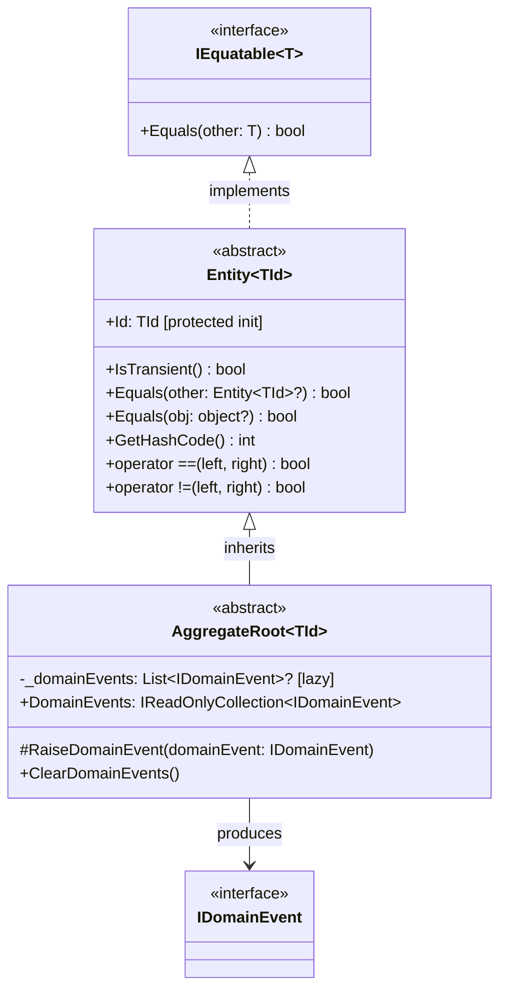
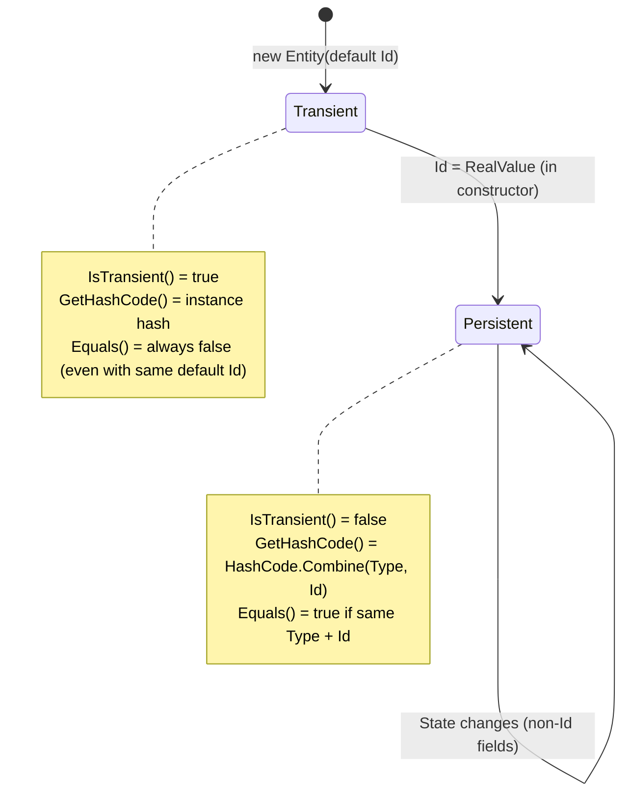
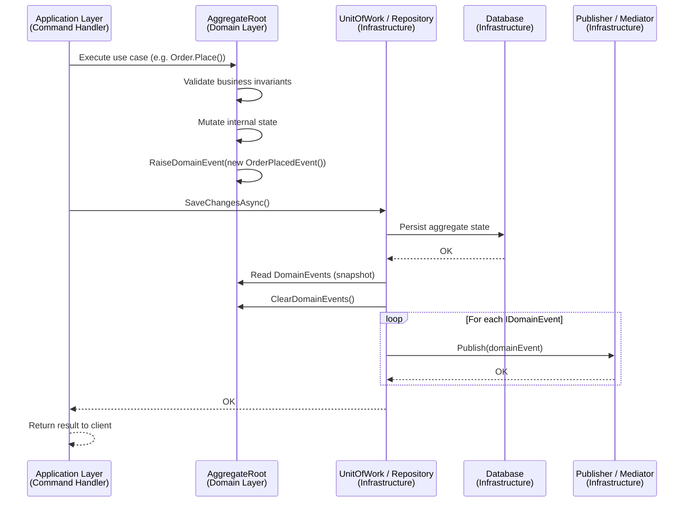
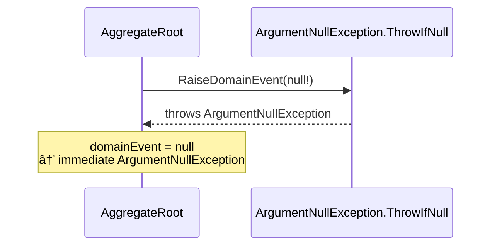
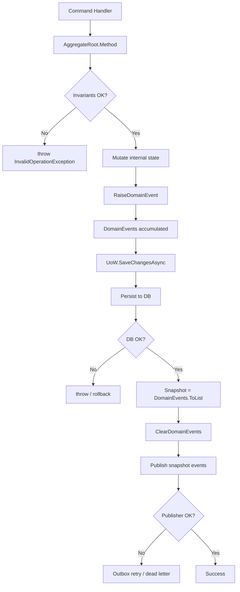
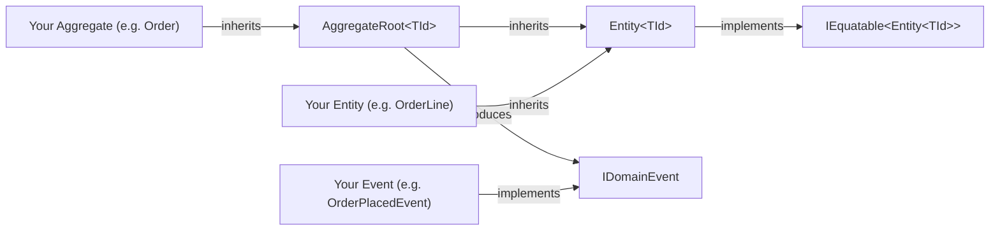
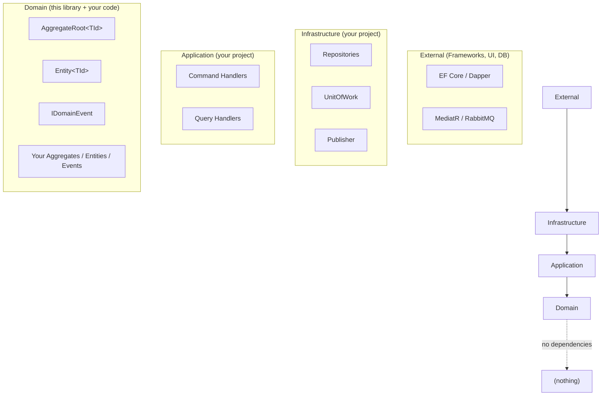

# Architecture Guide — EricksonLopez.SharedKernel

This guide describes the architecture of the library and how its components fit within the context of Domain-Driven Design (DDD).

---

## General Architecture

The library exposes a minimal set of primitives that act as the foundation of the Domain layer in a Clean Architecture.



---

## Entity State Diagram



---

## Main Flow — Domain Event Generation and Dispatch



---

## Error Flow — RaiseDomainEvent with null



---

## Pipeline Diagram — UnitOfWork Pattern



---

## Component Dependencies



---

## Architectural Layers



**Rule:** Arrows point inward. The Domain has no external dependencies.

---

## Transactional Boundary

In DDD, the `AggregateRoot` is the transactional boundary. The library enforces this concept by allowing **only** aggregates (not base entities) to register `IDomainEvent`.

```
Database transaction
│
└─ UnitOfWork.SaveChangesAsync()
      │
      ├─ Persists all AggregateRoot state changes
      └─ Dispatches all AggregateRoot DomainEvents
            (or saves them to an Outbox within the same transaction)
```

One transaction = one AggregateRoot (the golden rule of DDD).

---

## Integration with Infrastructure

The library provides the domain contract. Infrastructure implements the adapters:

| Infrastructure Component | Uses from the library |
|---|---|
| Repository | `Entity<TId>.Id` as the key |
| UnitOfWork | `AggregateRoot<TId>.DomainEvents` + `ClearDomainEvents()` |
| Publisher / Outbox | Receives `IDomainEvent` |
| Event Handlers | Receive the concrete `IDomainEvent` |