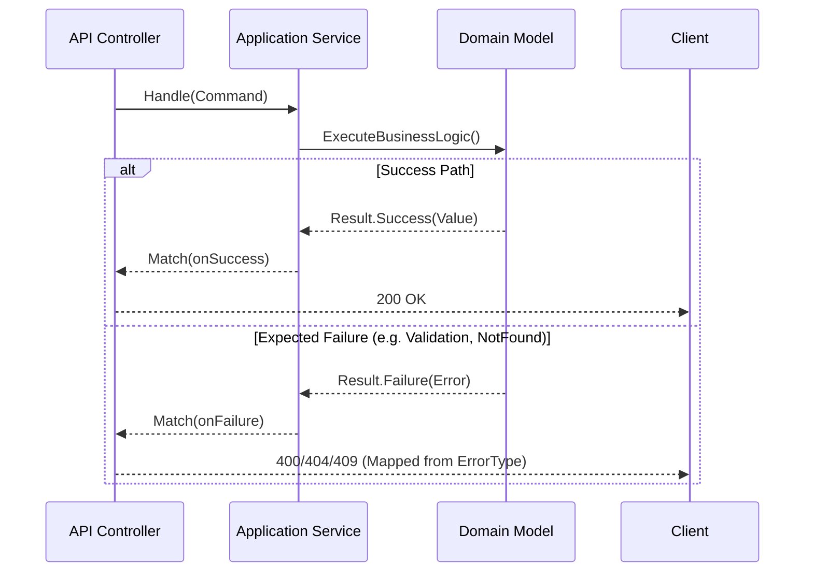
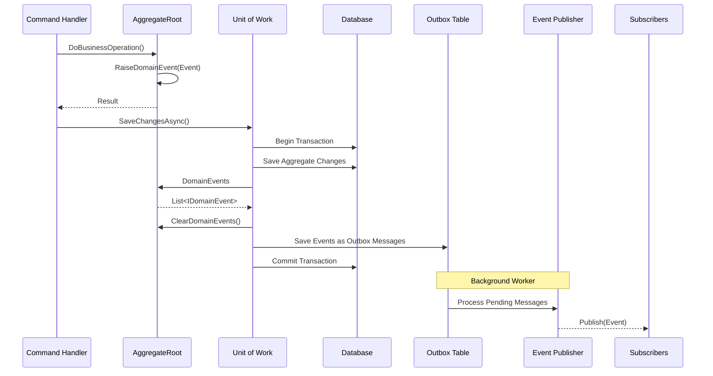

# Architecture

This document describes the foundational architectural patterns implemented in `EricksonLopez.SharedKernel`.

## The Result Pattern

The `Result` and `Result<T>` types provide a functional approach to error handling, completely avoiding the use of exceptions for expected domain failures.



### Result Pipeline Flow

```mermaid
flowchart TD
    Start[Start Operation] --> Validate[Ensure(predicate)]
    Validate -- Failure --> Error[MapError / Return]
    Validate -- Success --> Map[Map(dto)]
    Map --> Tap[Tap(side_effect)]
    Tap --> End[Return Result<T>]
    
    style Error fill:#ff9999,stroke:#333,stroke-width:2px
    style End fill:#99ccff,stroke:#333,stroke-width:2px
```

## Domain Events & Outbox Pattern

The `AggregateRoot` is the only entity allowed to raise `IDomainEvent`s. This ensures the consistency boundary is respected. The events are typically dispatched by the infrastructure layer (Unit of Work) and persisted using the Outbox pattern.


