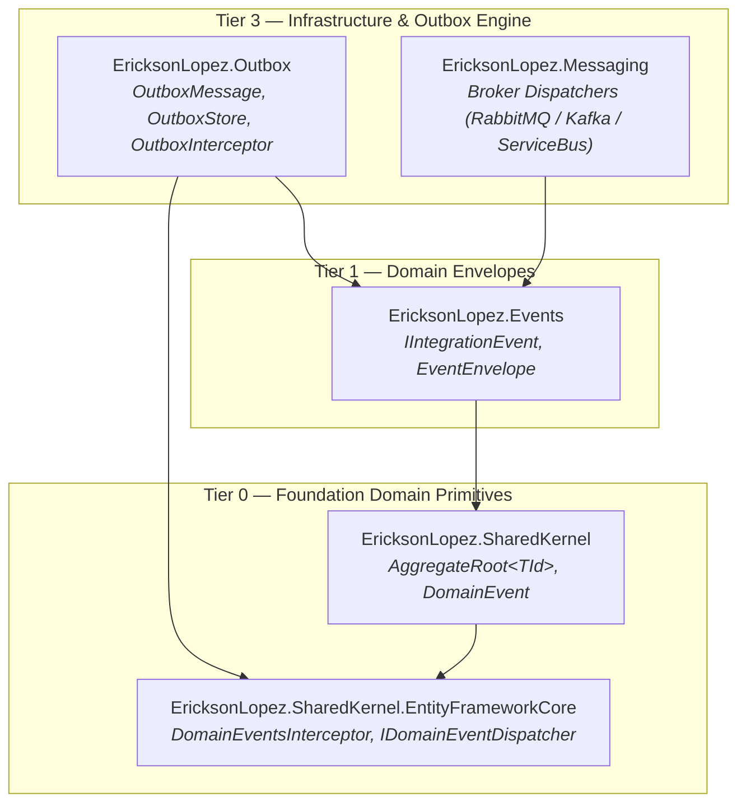

# ADR-032: Outbox Pattern Architectural Boundary & Rejection of SharedKernel Outbox Package

**Status:** Accepted  
**Date:** 2026-08-19  
**Author:** Erickson Lopez  
**Supersedes:** N/A  
**Related:** [ADR-002](ADR-002-zero-functional-dependencies.md) (Zero Functional Dependencies), [ADR-014](ADR-014-removal-of-result-dependency.md) (Removal of Result Dependency), [ADR-019](ADR-019-rejection-of-unit-of-work.md) (Rejection of Unit of Work)

---

## Context

In distributed Domain-Driven Design (DDD) and Clean Architecture systems, domain state mutations and integration message emissions must be executed with atomic transactional guarantees. The **Transactional Outbox Pattern** ensures that when an Aggregate Root emits events, those events are saved in the same local database transaction as the entity state changes, and later reliably dispatched to messaging brokers (e.g., RabbitMQ, Apache Kafka, Azure Service Bus) by a background worker/relay process.

A strategic architectural question arose regarding where the Outbox Pattern should reside within the `EricksonLopez.*` multi-tier ecosystem:

1. **Option 1:** Create an `EricksonLopez.SharedKernel.Outbox` package within Tier 0 (`dotnet-shared-kernel` repository).
2. **Option 2:** Consolidate all Transactional Outbox persistence and relay infrastructure in the dedicated Tier 3 package `EricksonLopez.Outbox`, leveraging `EricksonLopez.SharedKernel.EntityFrameworkCore`'s existing `DomainEventsInterceptor` and `IDomainEventDispatcher` contracts.

---

## Decision

**We formally REJECT the creation of an `EricksonLopez.SharedKernel.Outbox` package in Tier 0, and affirm that the Transactional Outbox pattern is exclusively owned by `EricksonLopez.Outbox` (Tier 3).**

### Architectural Topology & Flow

### Rationale

1. **Single Responsibility & Clean Tiers:**
   - `EricksonLopez.SharedKernel` (Tier 0) defines pure domain primitives (`Entity<TId>`, `AggregateRoot<TId>`, `DomainEvent`, `IStrongId<TSelf, TValue>`) and persistence bridges (`DomainEventsInterceptor`). Its sole responsibility regarding events is **recording in-memory domain events and transferring ownership upon drain** (`IHasDomainEvents.DrainDomainEvents()`).
   - `EricksonLopez.Outbox` (Tier 3) is an infrastructure engine. It defines relational database schemas (`OutboxMessage` table), payload serialization formats, deduplication keys, polling/CDC relay workers, exponential backoff retries, and dead-letter queue routing.

2. **Zero Dependency & Invariant Protection (ADR-002):**
   - Incorporating Outbox capabilities into `SharedKernel` would require referencing serialization abstractions, database schema configurations, and background hosted services. This violates the core invariant of Tier 0 (pure BCL and zero functional dependencies).

3. **Ecosystem Harmonization without Overlap:**
   - `EricksonLopez.SharedKernel.EntityFrameworkCore` already exposes the exact extension points required by `EricksonLopez.Outbox`:
     - `DomainEventsInterceptor` extracts all pending events from tracked `IHasDomainEvents` entities during `SaveChanges`/`SaveChangesAsync`.
     - `IDomainEventDispatcher` allows `EricksonLopez.Outbox` (or the application) to intercept those events and stage them as `OutboxMessage` records into the same `DbContext` before the transaction commits.

---

## Consequences

### Positive

- **Architectural Purity:** `SharedKernel` remains minimal, pure, and focused exclusively on domain primitives and Native AOT compatibility.
- **Zero Package Duplication:** Eliminates semantic ambiguity across the ecosystem; developers know that Outbox persistence always comes from `EricksonLopez.Outbox`.
- **Seamless Integration:** `EricksonLopez.Outbox` cleanly plugs into `DomainEventsInterceptor` via `IDomainEventDispatcher` or custom interceptors without modifying Tier 0 contracts.

### Negative

- None. Developers wanting an Outbox install `EricksonLopez.Outbox` at the infrastructure layer as designed in the Ecosystem Reference Architecture.
