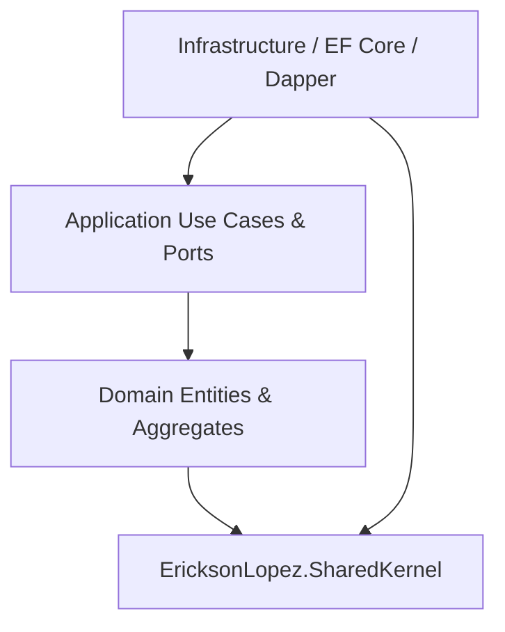

# Architecture & Design Overview

This document describes the foundational architectural patterns, memory models, and Clean Architecture boundary invariants of `EricksonLopez.SharedKernel`.

---

## 1. Clean Architecture & Dependency Direction

`EricksonLopez.SharedKernel` sits at the innermost core of the enterprise dependency tree:

### Sovereign Invariants
1. **Zero External Dependencies**: Core `EricksonLopez.SharedKernel` references pure .NET BCL types only.
2. **Result-First Functional Error Handling**: Domain operations return Result wrappers rather than throwing control-flow exceptions.
3. **NativeAOT Trimming Compatibility**: All persistence helpers and source generators enforce zero runtime reflection.
