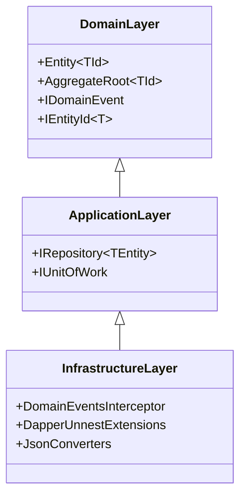

# Bounded Context & Layer Boundaries

---

## 1. Domain vs Infrastructure Segregation

- **Domain Layer**: Completely isolated from database connection strings, ORM contexts, and serializer options.
- **Application Layer**: Declares persistence port interfaces (`IRepository`, `IUnitOfWork`).
- **Infrastructure Layer**: Implements adapters using EF Core or Dapper.
