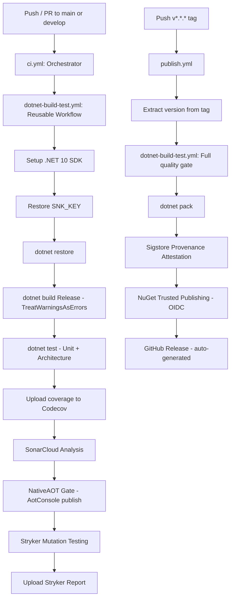

# CI/CD Pipeline — EricksonLopez.SharedKernel

Documentation for the build, test, and publish pipeline of this repository.

---

## Overview

The pipeline consists of **three GitHub Actions workflows** and **one Dependabot configuration**:

| File | Type | Trigger |
|---|---|---|
| `.github/workflows/ci.yml` | Orchestrator | Push / PR to `main`, `develop` |
| `.github/workflows/dotnet-build-test.yml` | Reusable workflow | Called by `ci.yml` and `publish.yml` |
| `.github/workflows/publish.yml` | Publish + Release | Push of `v*.*.*` tag |
| `.github/dependabot.yml` | Dependency automation | Weekly (Monday) |

---

## Pipeline Flow



---

## Workflow 1: `ci.yml` — Orchestrator

**File:** [.github/workflows/ci.yml](../.github/workflows/ci.yml)

**Trigger:**
- Push to `main` or `develop`
- Pull Requests targeting `main` or `develop`

**Description:** A thin orchestrator that delegates all work to the reusable `dotnet-build-test.yml` workflow, passing the required secrets.

```yaml
on:
  push:
    branches: [main, develop]
  pull_request:
    branches: [main, develop]
```

**Secrets passed:**
| Secret | Purpose |
|---|---|
| `SNK_KEY` | Base64-encoded Strong Name key for assembly signing |
| `CODECOV_TOKEN` | Codecov upload authorization |
| `SONAR_TOKEN` | SonarCloud analysis authorization |

---

## Workflow 2: `dotnet-build-test.yml` — Reusable Build & Test

**File:** [.github/workflows/dotnet-build-test.yml](../.github/workflows/dotnet-build-test.yml)

**Type:** Reusable workflow (`workflow_call`)

**Platform:** `ubuntu-latest`

### Jobs and Steps

| Step | Command | Purpose |
|---|---|---|
| Setup .NET | `actions/setup-dotnet@v4` | Installs .NET 10 SDK |
| Restore SNK key | `base64 --decode` | Decodes `SNK_KEY` secret → `EricksonLopez.snk` |
| Restore | `dotnet restore` | Restores NuGet packages |
| Build | `dotnet build --configuration Release` | Builds all projects; `TreatWarningsAsErrors` enforced |
| Test | `dotnet test --configuration Release` | Runs UnitTests + ArchitectureTests |
| Coverage upload | `codecov/codecov-action@v5` | Uploads Codecov report |
| SonarCloud | `SonarSource/sonarcloud-github-action` | Static analysis |
| NativeAOT gate | `dotnet publish -r linux-x64 -p:PublishAot=true` | Compiles `AotConsole` — fails on `IL3050`/`IL2026` |
| Stryker | `dotnet stryker` | Mutation testing — fails if score < 95% |
| Upload Stryker report | `actions/upload-artifact` | Preserves `report.json` |

### Quality Gates

| Gate | Threshold | Failure Behavior |
|---|---|---|
| Build warnings | 0 | Immediate failure (`TreatWarningsAsErrors`) |
| Test pass rate | 100% | Immediate failure |
| NativeAOT warnings (IL3050/IL2026) | 0 | Immediate failure |
| Stryker mutation score | ≥ 95% | Failure (`break=95` in `stryker-config.json`) |

---

## Workflow 3: `publish.yml` — Pack & Publish

**File:** [.github/workflows/publish.yml](../.github/workflows/publish.yml)

**Trigger:** Push of a tag matching `v*.*.*` (e.g. `v1.2.0`, `v2.0.0-preview.1`)

**Permissions required:** `id-token: write`, `contents: write`, `attestations: write`

### Steps

1. **Extract version** — strips the `v` prefix from the tag (`v1.2.3` → `1.2.3`)
2. **Restore SNK key** — same as in the CI workflow
3. **Restore + Build + Test** — full quality gate before packing
4. **Pack** — `dotnet pack` with the version from the tag
5. **Sigstore Provenance Attestation** — `actions/attest-build-provenance@v1` generates a cryptographic attestation for the `.nupkg`
6. **NuGet Trusted Publishing** — `NuGet/login@v1` authenticates via OIDC (no static API key stored)
7. **Push to NuGet.org** — `dotnet nuget push` with `--skip-duplicate`
8. **GitHub Release** — creates a GitHub Release with the `.nupkg` attached, marks as pre-release if the tag contains a hyphen (e.g. `-preview`)

### Release Naming Convention

| Tag | NuGet Version | Pre-release |
|---|---|---|
| `v1.2.0` | `1.2.0` | No |
| `v2.0.0-preview.1` | `2.0.0-preview.1` | Yes |

---

## Required Secrets

Configure these in the repository's **Settings → Secrets and variables → Actions**:

| Secret Name | Purpose | How to obtain |
|---|---|---|
| `SNK_KEY` | Strong Name key for assembly signing (base64 encoded) | `[Convert]::ToBase64String([IO.File]::ReadAllBytes('EricksonLopez.snk'))` |
| `CODECOV_TOKEN` | Codecov upload token | [codecov.io](https://codecov.io) → Repository Settings → Token |
| `SONAR_TOKEN` | SonarCloud analysis token | [sonarcloud.io](https://sonarcloud.io) → Account → Security |

> [!NOTE]
> `SNK_KEY` is **optional**. If the secret is empty or absent, the pipeline will skip assembly signing and the build will succeed. Signing is conditional in `Directory.Build.props`.

---

## Dependabot Configuration

**File:** [.github/dependabot.yml](../.github/dependabot.yml)

Dependabot checks for updates **weekly on Mondays**:

| Ecosystem | Scope | PR Limit |
|---|---|---|
| NuGet | `/` (all projects) | 10 |
| GitHub Actions | `/` (all workflows) | 5 |

PRs are labelled `dependencies` (NuGet) or `dependencies, ci` (GitHub Actions).

---

## Running the Pipeline Locally

### Full build + test
```bash
dotnet restore
dotnet build --configuration Release
dotnet test --configuration Release
```

### NativeAOT gate
```bash
dotnet publish samples/EricksonLopez.SharedKernel.AotConsole/EricksonLopez.SharedKernel.AotConsole.csproj \
  -c Release -r linux-x64 -p:PublishAot=true
```

### Stryker mutation testing
```bash
dotnet tool restore
dotnet stryker
```

### Pack (dry-run)
```bash
dotnet pack src/EricksonLopez.SharedKernel/EricksonLopez.SharedKernel.csproj \
  --configuration Release --output ./nupkgs -p:VersionPrefix=2.0.0
```
