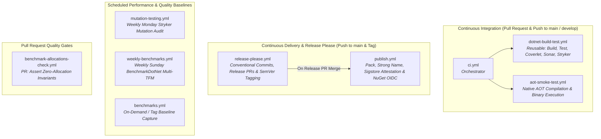
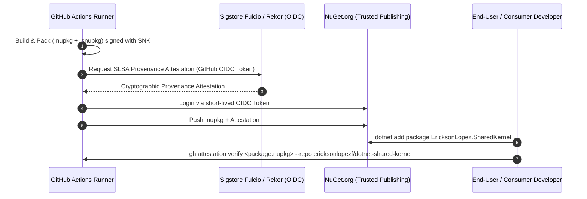

# CI/CD Pipeline & Automation — EricksonLopez.SharedKernel

Comprehensive technical documentation for all build, test, quality, benchmarks, and release automation pipelines in `EricksonLopez.SharedKernel`.

---

## 1. Workflows Architecture Overview

The repository utilizes **9 GitHub Actions workflows** and **1 Dependabot configuration**:



---

## 2. Workflows Catalog

| Workflow File | Type / Name | Trigger | Secrets Required | Produced Artifacts |
|---|---|---|---|---|
| `.github/workflows/ci.yml` | **CI Orchestrator** | Push / PR to `main`, `develop` | `SNK_KEY`, `CODECOV_TOKEN`, `SONAR_TOKEN` | Test results, Coverage reports |
| `.github/workflows/dotnet-build-test.yml` | **Reusable Build & Test** | `workflow_call` | `SNK_KEY`, `CODECOV_TOKEN`, `SONAR_TOKEN` | `test-results`, Codecov upload |
| `.github/workflows/aot-smoke-test.yml` | **Native AOT Smoke Gate** | Push / PR to `main`, `develop`, `workflow_call`, `workflow_dispatch` | `SNK_KEY` (optional) | `aot-output` (on failure) |
| `.github/workflows/benchmark-allocations-check.yml` | **PR Zero-Allocation Gate** | PR to `main`, `workflow_dispatch` | `SNK_KEY` (optional) | `pr-benchmark-results-<run_id>` |
| `.github/workflows/publish.yml` | **Pack & Publish** | Push of `v*.*.*` tag, `workflow_dispatch` | `SNK_KEY` | `.nupkg`, Sigstore attestation, GitHub Release |
| `.github/workflows/release-please.yml` | **Release Automation** | Push to `main` | `GITHUB_TOKEN` | Release PR, GitHub Tag, Release notes |
| `.github/workflows/benchmarks.yml` | **Baseline Benchmarks** | Tag push `v*`, `workflow_dispatch` | `SNK_KEY` | `benchmarks/results/` commits, `benchmark-results` |
| `.github/workflows/weekly-benchmarks.yml` | **Weekly Deep Benchmarks** | Weekly Sunday at 02:00 UTC, `workflow_dispatch` | `SNK_KEY` | `benchmarks/results/` commits, `weekly-benchmark-results` |
| `.github/workflows/mutation-testing.yml` | **Deferred Mutation Quality Gate** | Push to `main`, Weekly Monday at 04:00 UTC, `workflow_dispatch` | `SNK_KEY` | `stryker-report-*`, `stryker-summary-*` |

---

## 3. Workflow Details

### 1. `ci.yml` — CI Orchestrator
- **File:** [`.github/workflows/ci.yml`](../.github/workflows/ci.yml)
- **Purpose:** Entry point for pull requests and pushes to `main` and `develop`. Concurrently invokes `dotnet-build-test.yml` and `aot-smoke-test.yml`.
- **Quality Gate:** All sub-workflows must succeed before PR merge is permitted.

### 2. `dotnet-build-test.yml` — Reusable Build, Test & Quality Pipeline
- **File:** [`.github/workflows/dotnet-build-test.yml`](../.github/workflows/dotnet-build-test.yml)
- **Platform:** `ubuntu-latest` (.NET SDK 10.0.x, Java 17 for SonarScanner).
- **Execution Steps:**
  1. **Restore SNK key:** Base64 decodes `SNK_KEY` secret $\rightarrow$ `EricksonLopez.snk`.
  2. **Restore dependencies:** `dotnet restore`.
  3. **Static analysis setup:** Initializes SonarCloud Scanner via `dotnet-sonarscanner`.
  4. **Build:** `dotnet build --configuration Release` with `TreatWarningsAsErrors=true` and `WarningLevel=5`.
  5. **Run tests:** Executes `EricksonLopez.SharedKernel.slnx` with Coverlet collector (`XPlat Code Coverage`).
  6. **Mutation Testing:** Runs `dotnet stryker` with break threshold at 95%.
  7. **Coverage Upload:** Uploads Cobertura coverage to Codecov via `codecov/codecov-action`.

### 3. `aot-smoke-test.yml` — Native AOT Smoke Test Gate
- **File:** [`.github/workflows/aot-smoke-test.yml`](../.github/workflows/aot-smoke-test.yml)
- **Purpose:** Proves real Native AOT compatibility without dynamic code or reflection warnings.
- **Execution Steps:**
  1. Installs native compilation toolchains (`clang`, `lld`, `zlib1g-dev`).
  2. Compiles `tests/EricksonLopez.SharedKernel.NativeAotTests` and `samples/EricksonLopez.SharedKernel.Sample` with `-p:PublishAot=true`, `-r linux-x64`, `--self-contained`, and `-p:TreatWarningsAsErrors=true`.
  3. Fails immediately on any trimmer warning (`IL2026`, `IL3050`).
  4. Executes the native binaries and validates zero exit codes.

### 4. `publish.yml` — Package Packaging & Trusted Publishing
- **File:** [`.github/workflows/publish.yml`](../.github/workflows/publish.yml)
- **Permissions:** `id-token: write`, `contents: write`, `attestations: write`.
- **Execution Steps:**
  1. Resolves semantic version from `inputs.version`, git tag, or `Directory.Build.props`.
  2. Executes full test suite before packaging.
  3. Packs package: `dotnet pack src/EricksonLopez.SharedKernel/EricksonLopez.SharedKernel.csproj --configuration Release -p:VersionPrefix=<VERSION>`.
  4. Generates **Sigstore Build Provenance Attestation** (SLSA v1.0 predicate) via `actions/attest-build-provenance@v2`.
  5. Authenticates with NuGet via **NuGet Trusted Publishing (OIDC)** using `NuGet/login@v1`.
  6. Pushes package to NuGet.org with `--skip-duplicate`.
  7. Creates GitHub Release attaching `.nupkg` and `.snupkg` symbols.

### 5. `release-please.yml` — Automated SemVer & Changelog Management
- **File:** [`.github/workflows/release-please.yml`](../.github/workflows/release-please.yml)
- **Configuration:** [`.release-please-config.json`](../.release-please-config.json)
- **Purpose:** Analyzes Conventional Commits (`feat:`, `fix:`, `feat!:`, `perf:`, `security:`) on `main`. Automatically generates and updates release PRs, bumps `<VersionPrefix>` in `Directory.Build.props`, maintains `CHANGELOG.md`, and triggers `publish.yml` upon merge.

### 6. `benchmarks.yml` & `weekly-benchmarks.yml` — Performance Tracking
- **Files:** [`.github/workflows/benchmarks.yml`](../.github/workflows/benchmarks.yml) & [`.github/workflows/weekly-benchmarks.yml`](../.github/workflows/weekly-benchmarks.yml)
- **Purpose:** Executes BenchmarkDotNet benchmarks across .NET 8, .NET 9, and .NET 10 runtimes. Commits verified markdown baselines directly into `benchmarks/results/` with `[skip ci]`.

### 7. `mutation-testing.yml` — Deferred Mutation Quality Gate
- **File:** [`.github/workflows/mutation-testing.yml`](../.github/workflows/mutation-testing.yml)
- **Triggers:** Push to `main`, Weekly Monday at 04:00 UTC schedule, and `workflow_dispatch`.
- **Purpose:** Acts as an asynchronous, non-blocking quality gate for `main`. Analyzes all 7 framework packages via Stryker.NET. Sets the GitHub commit status `mutation-testing/stryker` required by `publish.yml` release validation.
- **Thresholds:** High = 100%, Low = 98%, Break = 95% (single source of truth configured in `stryker-*.json`).
- **Output:** Uploads HTML/JSON reports and summary artifacts, posts per-package and consolidated GitHub Step Summaries, and publishes commit status.

### 8. `benchmark-allocations-check.yml` — PR Zero-Allocation Regression Gate
- **File:** [`.github/workflows/benchmark-allocations-check.yml`](../.github/workflows/benchmark-allocations-check.yml)
- **Trigger:** Every Pull Request targeting `main`, and `workflow_dispatch`.
- **Purpose:** Runs `BenchmarkDotNet` benchmarks with the `--job short` configuration and asserts that all `EricksonLopez.*` benchmark methods allocate **exactly 0 bytes** per operation. Any positive `BytesAllocatedPerOperation` value fails the PR gate immediately.
- **Execution Steps:**
  1. Restores SNK key (optional — from `SNK_KEY` secret).
  2. Builds solution in `Release` configuration.
  3. Runs benchmarks with `--exporters json --memory`.
  4. PowerShell assertion script validates every `EricksonLopez.*` benchmark reports `BytesAllocatedPerOperation == 0`.
  5. Uploads benchmark JSON results as `pr-benchmark-results-<run_id>` artifact (retained 7 days).
- **Secrets Required:** `SNK_KEY` (optional).

---

## 4. Supply Chain Security Architecture



---

## 5. Required Secrets Configuration

Configure under repository **Settings $\rightarrow$ Secrets and variables $\rightarrow$ Actions**:

| Secret Name | Required / Optional | Purpose | Generation / Acquisition |
|---|---|---|---|
| `SNK_KEY` | Optional (Build succeeds without) | Base64-encoded Strong Name private key | `[Convert]::ToBase64String([IO.File]::ReadAllBytes('EricksonLopez.snk'))` |
| `CODECOV_TOKEN` | Required for CI coverage | Codecov authorization token | Codecov Repository Settings |
| `SONAR_TOKEN` | Required for Sonar analysis | SonarCloud authorization token | SonarCloud Account Security |

---

## 6. Dependabot Configuration

**File:** [`.github/dependabot.yml`](../.github/dependabot.yml)

Dependabot scans dependencies weekly on Mondays:
- **NuGet Ecosystem:** Target directory `/`, PR limit 10.
- **GitHub Actions:** Target directory `/`, PR limit 5.

---

## 7. Running Pipelines Locally

### Clean Build & Test
```bash
dotnet clean
dotnet restore
dotnet build --configuration Release
dotnet test --configuration Release
```

### Native AOT Smoke Test
```bash
dotnet publish tests/EricksonLopez.SharedKernel.NativeAotTests/EricksonLopez.SharedKernel.NativeAotTests.csproj \
  -c Release -r linux-x64 -p:PublishAot=true
```

### Stryker Mutation Testing
```bash
dotnet tool restore
dotnet stryker
```

### Local Dry-Run Packaging
```bash
dotnet pack src/EricksonLopez.SharedKernel/EricksonLopez.SharedKernel.csproj \
  --configuration Release --output ./nupkgs -p:VersionPrefix=1.1.0
```
