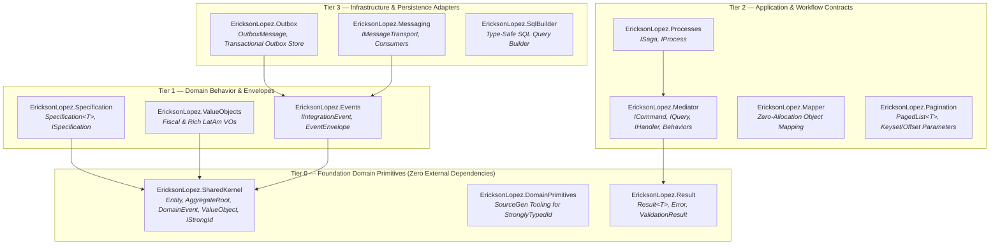
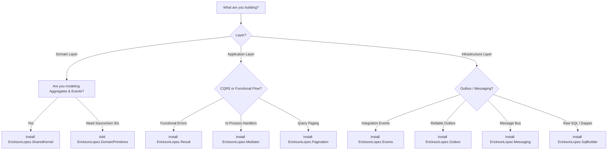

# Ecosystem Reference Architecture — `EricksonLopez.*`

The `EricksonLopez.*` library suite is a modular, high-performance .NET ecosystem built for Domain-Driven Design (DDD), Clean Architecture, CQRS, and Native AOT compilation.

Instead of a monolithic "god-framework", concerns are partitioned into focused, single-responsibility packages organized by architectural tiers.

---

## 🏛️ Tiered Architectural Topology



---

## 📦 Package Catalog & Responsibilities

| Package | Tier | Responsibility | Dependencies | Target Frameworks |
|---|---|---|---|---|
| **`EricksonLopez.SharedKernel`** | **Tier 0** | Core DDD identity, aggregate roots, domain events, value objects, and strongly-typed ID contracts. | Pure .NET BCL | `net8.0`, `net9.0`, `net10.0` |
| **`EricksonLopez.DomainPrimitives`** | **Tier 0** | Source Generators for Strongly Typed IDs and Roslyn code analysis. | Pure .NET BCL | `net8.0`, `net9.0`, `net10.0` |
| **`EricksonLopez.Result`** | **Tier 0** | Functional error handling, railway-oriented programming primitives. | Pure .NET BCL | `net8.0`, `net9.0`, `net10.0` |
| **`EricksonLopez.ValueObjects`** | **Tier 1** | Common domain value objects (Money, DateRange, Fiscal IDs). | `SharedKernel` | `net8.0`, `net9.0`, `net10.0` |
| **`EricksonLopez.Specification`** | **Tier 1** | Declarative query specification pattern and evaluators. | `SharedKernel` | `net8.0`, `net9.0`, `net10.0` |
| **`EricksonLopez.Events`** | **Tier 1** | Integration event contracts, message envelopes, correlation headers. | `SharedKernel` | `net8.0`, `net9.0`, `net10.0` |
| **`EricksonLopez.Mediator`** | **Tier 2** | In-process decoupled Command/Query dispatching and pipeline behaviors. | `Result` | `net8.0`, `net9.0`, `net10.0` |
| **`EricksonLopez.Processes`** | **Tier 2** | Long-running business processes and saga orchestration contracts. | `Mediator` | `net8.0`, `net9.0`, `net10.0` |
| **`EricksonLopez.Mapper`** | **Tier 2** | Ultra-fast, allocation-conscious object projection and mapping. | Pure .NET BCL | `net8.0`, `net9.0`, `net10.0` |
| **`EricksonLopez.Pagination`** | **Tier 2** | Keyset and offset pagination contracts for APIs and queries. | Pure .NET BCL | `net8.0`, `net9.0`, `net10.0` |
| **`EricksonLopez.Messaging`** | **Tier 3** | Distributed message transport (RabbitMQ, Kafka, Azure Service Bus). | `Events` | `net8.0`, `net9.0`, `net10.0` |
| **`EricksonLopez.Outbox`** | **Tier 3** | Transactional outbox persistence and background relay mechanisms. | `Events` | `net8.0`, `net9.0`, `net10.0` |
| **`EricksonLopez.SqlBuilder`** | **Tier 3** | Fluent, type-safe SQL query generation for Dapper/ADO.NET. | Pure .NET BCL | `net8.0`, `net9.0`, `net10.0` |

---

## 🎯 Decision Guide: "Which Packages Do I Need?"

Use this matrix to determine the minimal package footprint for your application layer:



---

## 🛠️ Cross-Package Integration Example

Here is how the packages seamlessly collaborate across Clean Architecture boundaries without tight coupling:

### 1. Domain Layer (`Domain.csproj`)
```csharp
using EricksonLopez.SharedKernel;

// Strongly Typed ID contract from SharedKernel
public readonly record struct OrderId(Guid Value) : IStrongId<OrderId, Guid>;

// Domain Event base record from SharedKernel
public sealed record OrderPlacedEvent(OrderId OrderId, decimal Amount) : DomainEvent;

// Aggregate Root from SharedKernel
public sealed class Order : AggregateRoot<OrderId>
{
    public decimal TotalAmount { get; private set; }

    public Order(OrderId id, decimal amount) : base(id)
    {
        if (amount <= 0)
            throw new ArgumentException("Amount must be positive", nameof(amount));

        TotalAmount = amount;
    }

    public static Order Place(OrderId id, decimal amount)
    {
        var order = new Order(id, amount);
        order.RaiseDomainEvent(new OrderPlacedEvent(id, amount));
        return order;
    }
}
```

### 2. Application Layer (`Application.csproj`)
```csharp
using EricksonLopez.Mediator;
using EricksonLopez.Result;

// Command handled via Mediator + Result error flow
public sealed record PlaceOrderCommand(Guid RawOrderId, decimal Amount) : ICommand<Result<Guid>>;

public sealed class PlaceOrderHandler : ICommandHandler<PlaceOrderCommand, Result<Guid>>
{
    private readonly IOrderRepository _repository;

    public PlaceOrderHandler(IOrderRepository repository) => _repository = repository;

    public async Task<Result<Guid>> Handle(PlaceOrderCommand command, CancellationToken ct)
    {
        if (command.Amount <= 0)
            return Result.Failure<Guid>(Error.Validation("Order.InvalidAmount", "Amount must exceed 0."));

        var orderId = new OrderId(command.RawOrderId);
        var order = Order.Place(orderId, command.Amount);

        await _repository.SaveAsync(order, ct);
        return Result.Success(order.Id.Value);
    }
}
```

### 3. Infrastructure Layer (`Infrastructure.csproj`)
```csharp
using EricksonLopez.Events;
using EricksonLopez.Outbox;

// Unit of Work or DbContext Save Interceptor captures domain events
public sealed class UnitOfWorkInterceptor
{
    private readonly IOutboxStore _outbox;

    public UnitOfWorkInterceptor(IOutboxStore outbox) => _outbox = outbox;

    public async Task OnBeforeCommitAsync(IEnumerable<IHasDomainEvents> aggregates, CancellationToken ct)
    {
        foreach (var aggregate in aggregates)
        {
            // DrainDomainEvents() atomically snapshots and clears events in one call.
            // No separate DomainEvents property or ClearDomainEvents() exists.
            var events = aggregate.DrainDomainEvents();

            foreach (var domainEvent in events)
            {
                // Convert domain event into an Integration Envelope
                var envelope = EventEnvelope.Create(domainEvent);
                await _outbox.AppendAsync(envelope, ct);
            }
        }
    }
}
```

---

## 🔒 Architectural Governance Rules

1. **Upward Dependency Invariant:** Dependencies strictly flow towards Tier 0 (`SharedKernel`, `Result`, `DomainPrimitives`). Tier 0 packages **NEVER** depend on higher tiers or external NuGet packages.
2. **Compile-Time AOT Guarantee:** Every package in the ecosystem must maintain `IsAotCompatible=true` and `IsTrimmable=true` across all supported TFMs (`net8.0`, `net9.0`, `net10.0`).
3. **No Monolithic Leakage:** Infrastructure concerns (e.g., ORM proxy unwrappers, MassTransit, EF Core interceptors) are strictly quarantined to Tier 3 or consumer applications.
