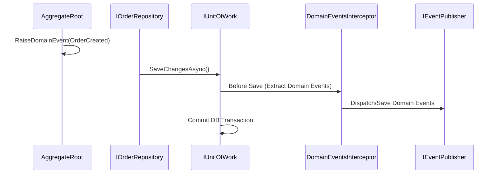

# Functional Map & Topology

---

## 1. Domain Event Raising & Persistence Flow

```mermaid
sequenceDiagram
    participant Aggregate as AggregateRoot
    participant Repo as IOrderRepository
    participant UoW as IUnitOfWork
    participant Interceptor as DomainEventsInterceptor
    participant Publisher as IEventPublisher

    Aggregate->>Aggregate: RaiseDomainEvent(OrderCreated)
    Repo->>UoW: SaveChangesAsync()
    UoW->>Interceptor: Before Save (Extract Domain Events)
    Interceptor->>Publisher: Dispatch/Save Domain Events
    UoW->>UoW: Commit DB Transaction
```
