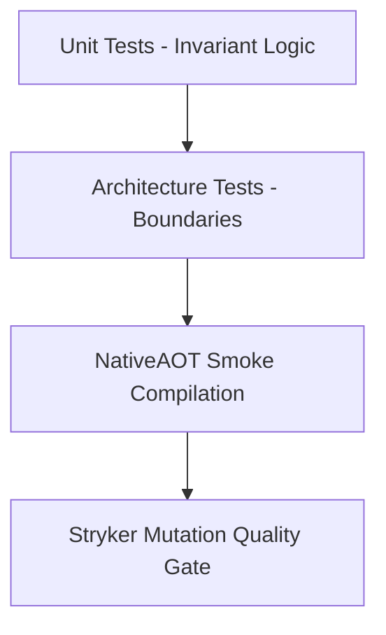

# Testing Strategy & Quality Roadmap

---

## 1. Testing Topology

- **Unit Tests**: Verifies aggregate invariants, strongly-typed ID equality, and lazy event allocations.
- **Architecture Tests**: Enforces Clean Architecture boundaries and zero-prohibited dependencies.
- **AOT Smoke Tests**: Verifies standalone native binary execution with `PublishAot=true`.
