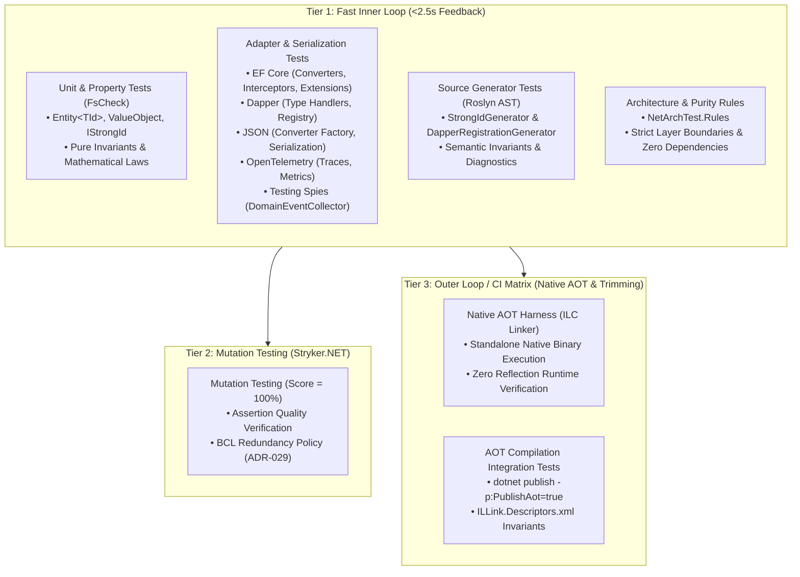

# Testing Strategy — EricksonLopez.SharedKernel

This repository follows a strict Tier 0 testing strategy designed to maintain highest-level reliability, zero-allocation invariants, and Native AOT compatibility across the Shared Kernel domain primitives and all infrastructure adapters.

## 1. Principles
- **FIRST Principle**: All tests must be Fast, Independent, Repeatable, Self-Validating, and Timely.
- **Fast Feedback Inner Loop**: In-memory unit, adapter, and architecture tests execute in under 2.5 seconds.
- **Pure Domain Invariants**: Core primitives run 100% in-memory without hitting the file system, network, or external databases.

## 2. Test Suite Architecture & Structure



| Project | Type | Scope & Description | Test Count | Execution Time |
|---|---|---|:---:|---|
| `EricksonLopez.SharedKernel.UnitTests` | Unit & Property (FsCheck) | Tests covering `Entity<TId>`, `AggregateRoot<TId>`, `DomainEvent`, `IStrongId` (Guid, int, long, and string FsCheck properties), `ValueObject`, trimming descriptors, zero-allocation invariants, and concurrent buffer detachment. | 98 | ~0.5s |
| `EricksonLopez.SharedKernel.EntityFrameworkCore.Tests` | Adapter & Interceptor | Grouped into `Interceptors/`, `Converters/`, `Extensions/`, and `Fixtures/`. Tests covering `StrongIdValueConverter` (including FsCheck string/int/guid properties and `DateOnly` types), `DomainEventsInterceptor`, tracked `EntityState` variants (Added, Modified, Deleted, Unchanged, Detached), high-volume event draining/dispatching (100 to 1,000,000 events), batch null-dispatcher event draining, cancellation propagation (including mid-flight dispatch cancellation), dispatcher exception handling, `TestDbContextFactory` isolation, model builder and DI extensions. | 70 | ~2.5s |
| `EricksonLopez.SharedKernel.SourceGenerators.Tests` | Source Generator (Roslyn) | Tests covering incremental source generation for `StrongIdGenerator` and `DapperRegistrationGenerator`, attribute discovery, diagnostic reporting, syntax tree generation, nested types, and compiler AST mutation resilience. | 26 | ~1.0s |
| `EricksonLopez.SharedKernel.Json.Tests` | Adapter, Serialization & Fuzzing | Tests covering `StrongIdJsonConverter` (including invalid format/overflow/null value branches), `StrongIdJsonConverterFactory`, cached converters, roundtrip DTO serialization, FsCheck string/int/guid properties, adversarial JSON token injections, corrupted streams, and fuzzing payloads. | 55 | ~0.5s |
| `EricksonLopez.SharedKernel.Dapper.Tests` | Adapter & TypeHandler | Tests covering `StrongIdTypeHandler` (including argument/format/overflow exception mapping), `DapperStrongIdRegistry`, assembly scanning (including no-strong-id no-op safety), concurrent registration, error handling, and FsCheck string/int/guid properties. | 22 | ~0.3s |
| `EricksonLopez.SharedKernel.ArchitectureTests` | Architecture & Purity Rules | Rules enforcing kernel purity, abstraction, zero external dependencies, XML documentation, namespace isolation, and automated ADR-029 Stryker suppression justification validation. | 20 | ~0.1s |
| `EricksonLopez.SharedKernel.OpenTelemetry.Tests` | Adapter & Observability | Tests covering `OpenTelemetryDomainEventDispatcher` tracing decorator, activity source tags, metrics (counters, histograms), error recording, and DI registration extensions. | 12 | ~0.3s |
| `EricksonLopez.SharedKernel.Testing.Tests` | Test Utility (Spies) | Tests covering `DomainEventCollector` assertion spies, event querying by type, fluent `AggregateRootTestExtensions`, and collector reset lifecycles across .NET 8, 9, and 10. | 11 | ~0.4s |
| `EricksonLopez.SharedKernel.IntegrationTests` | Integration (Native AOT CLI) | Outer-loop CI runner orchestrating `dotnet publish -p:PublishAot=true` and executing native binary processes against trimmed primitives while analyzing linker diagnostics. | 2 | ~30s |
| `EricksonLopez.SharedKernel.NativeAotTests` | Native AOT Harness | Standalone AOT assertion runner compiled directly via ILC linker to validate Native AOT runtime behavior. (Note: Kept separate from `IntegrationTests` due to fundamentally different test runner infrastructure requirements for AOT compilation). | 4 Suites | ~0.1s (native) |

Total Test Count: **305 Tests (100% Passing)**

## 3. Test Fixtures & Infrastructure
- **`EricksonLopez.SharedKernel.TestingUtilities`**: Centralizes pure fake strongly-typed IDs (`OrderId`, `CustomerId`, `ProductCode`, `DepartmentId`, `SequenceId`, `Quantity`, `DateOnlyId`, `NumericRangeId`), DTOs (`OrderDto`), and test marker types across test assemblies with zero third-party/infrastructure dependencies.
- **`TestDbContextFactory`**: Resides in `EricksonLopez.SharedKernel.EntityFrameworkCore.Tests.Fixtures` and provides centralized, isolated in-memory `DbContextOptions<TContext>` instantiation (`Guid.NewGuid().ToString("N")`) for EF Core tests without static duplication.

## 4. Naming Conventions
Tests follow the `Method_Scenario_Result` naming convention:
- `Constructor_WithDefaultGuid_ThrowsArgumentException`
- `SavingChangesAsync_WithCancellationToken_PropagatesCancellation`
- `SavingChangesAsync_WhenDispatcherThrows_PropagatesException`
- `Equals_WithSameIdAndType_ReturnsTrue`

## 5. Quality Libraries & Testing Paradigms

### Frameworks & Tools
- **xUnit**: Core test runner.
- **AwesomeAssertions**: Declarative, fluent assertions.
- **FsCheck & FsCheck.Xunit**: Property-based testing for mathematical invariant verification.
- **NetArchTest.Rules**: Enforces Clean Architecture layer boundaries and purity.
- **NSubstitute**: Clean, isolated test double generation for dispatchers.
- **Coverlet**: Cross-platform line/branch code coverage collector.
- **Stryker.NET**: Mutation testing framework for assertion verification.

### Property-Based Testing Conventions (FsCheck)
We use `FsCheck.Xunit` to verify algebraic invariants and roundtrip guarantees:
- **`NonNull<string>`**: Guarantees non-null string generation while handling domain-specific validation constraints (e.g. ignoring empty/whitespace strings if guarded by the domain).
- **`PositiveInt`**: Constrains numeric generators to positive domain boundaries ($> 0$).
- **Conditional Filtering**: Use `.When(condition)` for assumption filtering and domain constraints:
```csharp
[Property]
public Property JsonRoundtrip_PreservesGuidStrongId(Guid idValue)
{
    if (idValue == Guid.Empty)
        return false.When(false);

    var id = OrderId.Create(idValue);
    var json = JsonSerializer.Serialize(id, _options);
    var deserialized = JsonSerializer.Deserialize<OrderId>(json, _options);

    return (deserialized == id && deserialized.Value == idValue).When(idValue != Guid.Empty);
}
```

## 6. Running the Tests

### Ultra-Fast Inner Loop (Daily Development / Feedback < 150ms)
Runs unit, adapter, and architecture tests in memory excluding integration and heavy stress tiers:
```bash
dotnet test --filter "Category!=Integration&Category!=Stress" --settings .runsettings
```

### Fast Inner Loop (All In-Memory Tests including Stress Tiers < 2.5s)
```bash
dotnet test --filter "Category!=Integration" --settings .runsettings
```

### Native AOT Integration Tests (Pre-push / CI Matrix)
Compiles and executes real native binaries with Native AOT and Trimming analyzers enabled:
```bash
dotnet test --filter "Category=Integration" --settings .runsettings
```

### Stress Testing Tier (High-Volume Event Processing: 10K - 1M Events)
Executes extreme load and scale validation runs:
```bash
dotnet test --filter "Category=Stress" --settings .runsettings
```

### Full Solution Test Run
```bash
dotnet test --settings .runsettings
```

### Code Coverage Collection
```bash
dotnet test --settings .runsettings --collect:"XPlat Code Coverage"
```

## 7. Mutation Testing (Stryker.NET)
We employ Mutation Testing across all framework projects to verify the discrimination power of our assertions:
- **Thresholds**: 
  - High (Target): `100%`
  - Low (Warning): `98%`
  - Break Build: `95%`
- All domain invariants and adapter edge-cases must have assertions that fail if logic is mutated.
- BCL redundancies and guard clause mutant suppressions follow [ADR-029: Mutation Testing Strategy & BCL Redundancy Policy](../docs/decisions/ADR-029-mutation-testing-bcl-redundancy-policy.md).

To run mutation testing locally:
```bash
dotnet tool restore

# Core Library
dotnet stryker --config-file stryker-config.json

# EF Core Adapter
dotnet stryker --config-file stryker-efcore-config.json

# Dapper Adapter
dotnet stryker --config-file stryker-dapper-config.json

# JSON Adapter
dotnet stryker --config-file stryker-json-config.json

# OpenTelemetry Adapter
dotnet stryker --config-file stryker-otel-config.json

# Source Generators
dotnet stryker --config-file stryker-sourcegen-config.json

# Testing Utilities
dotnet stryker --config-file stryker-testing-config.json
```

